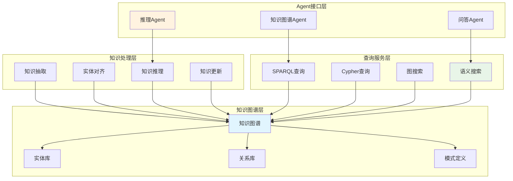
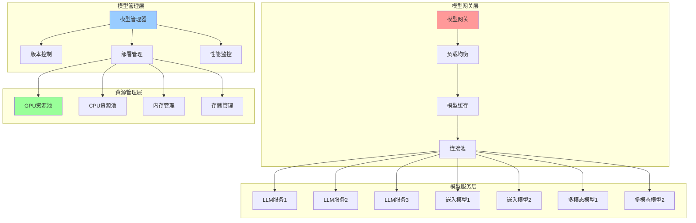
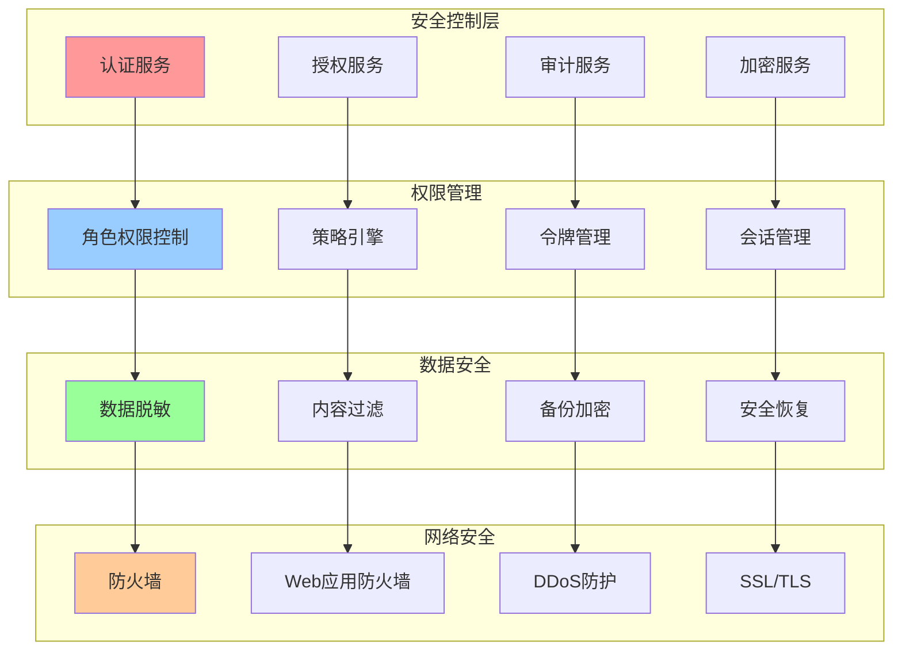
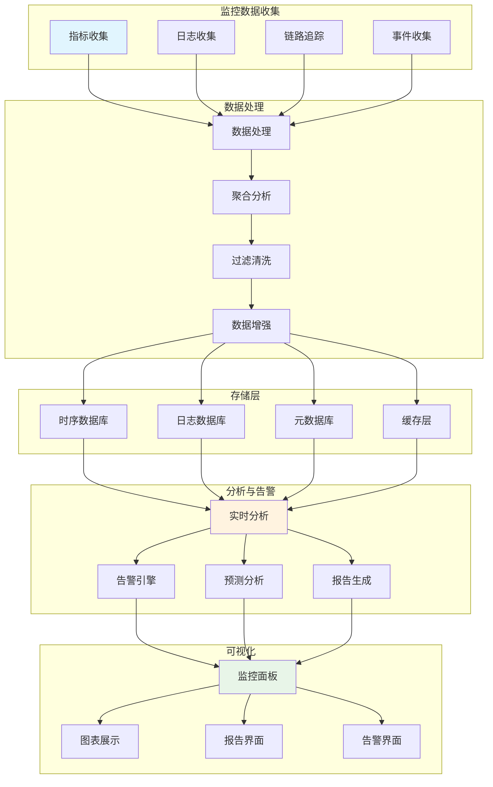
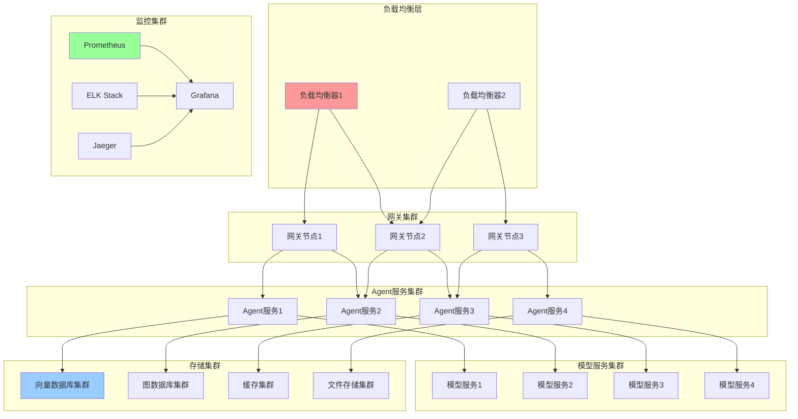

# 企业级大模型Agent框架架构设计：深度应用与复杂场景突破

## 前言

随着大模型技术的快速发展，企业对智能化应用的需求日益增长。如何构建一个既能支持复杂业务场景，又具备高可用性和可扩展性的大模型Agent框架，成为了技术团队面临的核心挑战。本文将深入剖析企业级大模型Agent框架的架构设计，重点解决多模态融合、复杂推理链、知识图谱集成等关键技术难题。

## 一、整体架构设计

### 1.1 系统架构概览


### 1.2 核心设计原则

#### 1.2.1 模块化与可扩展性

```python
from abc import ABC, abstractmethod
from typing import Dict, Any, List, Optional
from dataclasses import dataclass
from enum import Enum

class AgentType(Enum):
    """Agent类型枚举"""
    CHAT = "chat"
    RAG = "rag"
    CODE_GEN = "code_generation"
    DATA_ANALYSIS = "data_analysis"
    MULTIMODAL = "multimodal"
    TOOL = "tool"

@dataclass
class AgentCapability:
    """Agent能力定义"""
    name: str
    description: str
    input_types: List[str]
    output_types: List[str]
    required_models: List[str]
    optional_tools: List[str]

class BaseAgent(ABC):
    """Agent基类 - 定义标准接口"""
    
    def __init__(self, agent_id: str, config: Dict[str, Any]):
        self.agent_id = agent_id
        self.config = config
        self.capabilities = self._define_capabilities()
        self.state = {}
        
    @abstractmethod
    def _define_capabilities(self) -> List[AgentCapability]:
        """定义Agent能力"""
        pass
    
    @abstractmethod
    async def process(self, input_data: Dict[str, Any]) -> Dict[str, Any]:
        """处理输入数据"""
        pass
    
    @abstractmethod
    async def validate_input(self, input_data: Dict[str, Any]) -> bool:
        """验证输入数据"""
        pass
    
    async def pre_process(self, input_data: Dict[str, Any]) -> Dict[str, Any]:
        """预处理钩子"""
        return input_data
    
    async def post_process(self, output_data: Dict[str, Any]) -> Dict[str, Any]:
        """后处理钩子"""
        return output_data
    
    def get_metrics(self) -> Dict[str, Any]:
        """获取性能指标"""
        return {
            "agent_id": self.agent_id,
            "processed_requests": getattr(self, '_processed_requests', 0),
            "avg_response_time": getattr(self, '_avg_response_time', 0),
            "success_rate": getattr(self, '_success_rate', 1.0)
        }

class AgentRegistry:
    """Agent注册中心"""
    
    def __init__(self):
        self._agents: Dict[str, BaseAgent] = {}
        self._capabilities: Dict[str, List[str]] = {}
        
    def register_agent(self, agent: BaseAgent):
        """注册Agent"""
        self._agents[agent.agent_id] = agent
        
        # 构建能力索引
        for capability in agent.capabilities:
            if capability.name not in self._capabilities:
                self._capabilities[capability.name] = []
            self._capabilities[capability.name].append(agent.agent_id)
    
    def get_agent(self, agent_id: str) -> Optional[BaseAgent]:
        """获取Agent实例"""
        return self._agents.get(agent_id)
    
    def find_agents_by_capability(self, capability: str) -> List[BaseAgent]:
        """根据能力查找Agent"""
        agent_ids = self._capabilities.get(capability, [])
        return [self._agents[aid] for aid in agent_ids if aid in self._agents]
    
    def list_all_agents(self) -> List[BaseAgent]:
        """列出所有Agent"""
        return list(self._agents.values())
```

#### 1.2.2 异步处理与并发控制

```python
import asyncio
import aiohttp
from asyncio import Semaphore, Queue
from typing import Callable, Coroutine
import time
from contextlib import asynccontextmanager

class AsyncTaskManager:
    """异步任务管理器"""
    
    def __init__(self, max_concurrent_tasks: int = 100):
        self.max_concurrent_tasks = max_concurrent_tasks
        self.semaphore = Semaphore(max_concurrent_tasks)
        self.task_queue = Queue()
        self.active_tasks = set()
        self.metrics = {
            'total_tasks': 0,
            'completed_tasks': 0,
            'failed_tasks': 0,
            'avg_execution_time': 0
        }
    
    @asynccontextmanager
    async def task_context(self, task_id: str):
        """任务执行上下文"""
        start_time = time.time()
        self.metrics['total_tasks'] += 1
        
        try:
            async with self.semaphore:
                self.active_tasks.add(task_id)
                yield
                self.metrics['completed_tasks'] += 1
        except Exception as e:
            self.metrics['failed_tasks'] += 1
            raise
        finally:
            self.active_tasks.discard(task_id)
            execution_time = time.time() - start_time
            self._update_avg_execution_time(execution_time)
    
    def _update_avg_execution_time(self, execution_time: float):
        """更新平均执行时间"""
        total_completed = self.metrics['completed_tasks']
        if total_completed > 0:
            current_avg = self.metrics['avg_execution_time']
            self.metrics['avg_execution_time'] = (
                (current_avg * (total_completed - 1) + execution_time) / total_completed
            )
    
    async def execute_task(self, task_func: Callable, *args, **kwargs):
        """执行异步任务"""
        task_id = f"task_{int(time.time() * 1000000)}"
        
        async with self.task_context(task_id):
            if asyncio.iscoroutinefunction(task_func):
                return await task_func(*args, **kwargs)
            else:
                return task_func(*args, **kwargs)
    
    async def execute_batch(self, tasks: List[Callable], *args, **kwargs):
        """批量执行任务"""
        results = []
        async_tasks = []
        
        for task in tasks:
            async_task = self.execute_task(task, *args, **kwargs)
            async_tasks.append(async_task)
        
        results = await asyncio.gather(*async_tasks, return_exceptions=True)
        return results
    
    def get_status(self) -> Dict[str, Any]:
        """获取任务管理器状态"""
        return {
            'active_tasks': len(self.active_tasks),
            'available_slots': self.max_concurrent_tasks - len(self.active_tasks),
            'metrics': self.metrics.copy()
        }
```

## 二、核心组件深度解析

### 2.1 Agent编排器设计

#### 2.1.1 智能路由与负载均衡

```python
from typing import Dict, List, Optional, Tuple
from dataclasses import dataclass
from enum import Enum
import hashlib
import random
import time
from collections import defaultdict

class RoutingStrategy(Enum):
    """路由策略"""
    ROUND_ROBIN = "round_robin"
    WEIGHTED_ROUND_ROBIN = "weighted_round_robin"
    LEAST_CONNECTIONS = "least_connections"
    RESPONSE_TIME = "response_time"
    CAPABILITY_BASED = "capability_based"
    INTELLIGENT = "intelligent"

@dataclass
class AgentInstance:
    """Agent实例信息"""
    agent_id: str
    instance_id: str
    host: str
    port: int
    weight: float = 1.0
    current_load: int = 0
    avg_response_time: float = 0.0
    success_rate: float = 1.0
    last_health_check: float = 0.0
    is_healthy: bool = True
    capabilities: List[str] = None

class IntelligentRouter:
    """智能路由器"""
    
    def __init__(self):
        self.agents: Dict[str, List[AgentInstance]] = defaultdict(list)
        self.routing_strategies: Dict[str, RoutingStrategy] = {}
        self.load_balancer = LoadBalancer()
        self.health_monitor = HealthMonitor()
        
    def register_agent_instance(self, agent_type: str, instance: AgentInstance):
        """注册Agent实例"""
        self.agents[agent_type].append(instance)
        self.health_monitor.add_instance(instance)
    
    async def route_request(self, 
                           agent_type: str, 
                           request_context: Dict[str, Any],
                           strategy: Optional[RoutingStrategy] = None) -> Optional[AgentInstance]:
        """路由请求到合适的Agent实例"""
        
        available_instances = self._get_healthy_instances(agent_type)
        if not available_instances:
            return None
        
        # 选择路由策略
        effective_strategy = strategy or self.routing_strategies.get(
            agent_type, RoutingStrategy.INTELLIGENT
        )
        
        if effective_strategy == RoutingStrategy.INTELLIGENT:
            return await self._intelligent_routing(available_instances, request_context)
        else:
            return self.load_balancer.select_instance(available_instances, effective_strategy)
    
    async def _intelligent_routing(self, 
                                 instances: List[AgentInstance],
                                 context: Dict[str, Any]) -> AgentInstance:
        """智能路由算法"""
        
        # 计算每个实例的综合得分
        scores = []
        for instance in instances:
            score = await self._calculate_instance_score(instance, context)
            scores.append((instance, score))
        
        # 按得分排序，选择最佳实例
        scores.sort(key=lambda x: x[1], reverse=True)
        
        # 引入随机性，避免所有请求都路由到同一实例
        top_instances = scores[:min(3, len(scores))]
        weights = [score for _, score in top_instances]
        
        return self._weighted_random_select(
            [instance for instance, _ in top_instances], 
            weights
        )
    
    async def _calculate_instance_score(self, 
                                      instance: AgentInstance,
                                      context: Dict[str, Any]) -> float:
        """计算实例综合得分"""
        
        # 基础性能指标 (40%)
        performance_score = (
            (1.0 - instance.current_load / 100.0) * 0.4 +  # 负载情况
            instance.success_rate * 0.3 +  # 成功率
            (1.0 / (instance.avg_response_time + 0.1)) * 0.3  # 响应时间
        ) * 0.4
        
        # 能力匹配度 (30%)
        capability_score = self._calculate_capability_match(instance, context) * 0.3
        
        # 历史表现 (20%)
        history_score = self._calculate_history_performance(instance) * 0.2
        
        # 实时状态 (10%)
        real_time_score = self._calculate_real_time_status(instance) * 0.1
        
        return performance_score + capability_score + history_score + real_time_score
    
    def _calculate_capability_match(self, 
                                  instance: AgentInstance,
                                  context: Dict[str, Any]) -> float:
        """计算能力匹配度"""
        if not instance.capabilities:
            return 0.5  # 默认匹配度
        
        required_capabilities = context.get('required_capabilities', [])
        if not required_capabilities:
            return 1.0
        
        matched = len(set(instance.capabilities) & set(required_capabilities))
        return matched / len(required_capabilities)
    
    def _weighted_random_select(self, 
                               instances: List[AgentInstance],
                               weights: List[float]) -> AgentInstance:
        """加权随机选择"""
        total_weight = sum(weights)
        if total_weight == 0:
            return random.choice(instances)
        
        normalized_weights = [w / total_weight for w in weights]
        return random.choices(instances, weights=normalized_weights)[0]
    
    def _get_healthy_instances(self, agent_type: str) -> List[AgentInstance]:
        """获取健康的实例"""
        return [
            instance for instance in self.agents[agent_type]
            if instance.is_healthy
        ]

class LoadBalancer:
    """负载均衡器"""
    
    def __init__(self):
        self.round_robin_counters = defaultdict(int)
    
    def select_instance(self, 
                       instances: List[AgentInstance],
                       strategy: RoutingStrategy) -> AgentInstance:
        """根据策略选择实例"""
        
        if strategy == RoutingStrategy.ROUND_ROBIN:
            return self._round_robin_select(instances)
        elif strategy == RoutingStrategy.WEIGHTED_ROUND_ROBIN:
            return self._weighted_round_robin_select(instances)
        elif strategy == RoutingStrategy.LEAST_CONNECTIONS:
            return self._least_connections_select(instances)
        elif strategy == RoutingStrategy.RESPONSE_TIME:
            return self._response_time_select(instances)
        else:
            return random.choice(instances)
    
    def _round_robin_select(self, instances: List[AgentInstance]) -> AgentInstance:
        """轮询选择"""
        key = id(instances)  # 使用实例列表的ID作为键
        index = self.round_robin_counters[key] % len(instances)
        self.round_robin_counters[key] += 1
        return instances[index]
    
    def _least_connections_select(self, instances: List[AgentInstance]) -> AgentInstance:
        """最少连接选择"""
        return min(instances, key=lambda x: x.current_load)
    
    def _response_time_select(self, instances: List[AgentInstance]) -> AgentInstance:
        """最短响应时间选择"""
        return min(instances, key=lambda x: x.avg_response_time)
```

#### 2.1.2 工作流引擎

```python
from typing import Dict, List, Any, Optional, Callable, Union
from dataclasses import dataclass, field
from enum import Enum
import asyncio
import json
import uuid
from datetime import datetime

class NodeType(Enum):
    """节点类型"""
    START = "start"
    END = "end"
    AGENT = "agent"
    CONDITION = "condition"
    PARALLEL = "parallel"
    MERGE = "merge"
    LOOP = "loop"
    HUMAN = "human"

class ExecutionStatus(Enum):
    """执行状态"""
    PENDING = "pending"
    RUNNING = "running"
    COMPLETED = "completed"
    FAILED = "failed"
    CANCELLED = "cancelled"
    WAITING = "waiting"

@dataclass
class WorkflowNode:
    """工作流节点"""
    node_id: str
    node_type: NodeType
    name: str
    config: Dict[str, Any] = field(default_factory=dict)
    inputs: List[str] = field(default_factory=list)
    outputs: List[str] = field(default_factory=list)
    conditions: Dict[str, Any] = field(default_factory=dict)
    retry_config: Dict[str, Any] = field(default_factory=dict)

@dataclass
class WorkflowEdge:
    """工作流边"""
    from_node: str
    to_node: str
    condition: Optional[str] = None
    weight: float = 1.0

@dataclass
class WorkflowDefinition:
    """工作流定义"""
    workflow_id: str
    name: str
    description: str
    nodes: List[WorkflowNode]
    edges: List[WorkflowEdge]
    global_config: Dict[str, Any] = field(default_factory=dict)
    version: str = "1.0"

class WorkflowEngine:
    """工作流引擎"""
    
    def __init__(self, agent_registry: AgentRegistry):
        self.agent_registry = agent_registry
        self.active_executions: Dict[str, 'WorkflowExecution'] = {}
        self.execution_history: List['WorkflowExecution'] = []
        
    async def execute_workflow(self, 
                             workflow_def: WorkflowDefinition,
                             input_data: Dict[str, Any],
                             context: Dict[str, Any] = None) -> 'WorkflowExecution':
        """执行工作流"""
        
        execution_id = str(uuid.uuid4())
        execution = WorkflowExecution(
            execution_id=execution_id,
            workflow_def=workflow_def,
            input_data=input_data,
            context=context or {},
            engine=self
        )
        
        self.active_executions[execution_id] = execution
        
        try:
            await execution.start()
            return execution
        except Exception as e:
            execution.status = ExecutionStatus.FAILED
            execution.error = str(e)
            raise
        finally:
            self.execution_history.append(execution)
            if execution_id in self.active_executions:
                del self.active_executions[execution_id]
    
    async def cancel_execution(self, execution_id: str):
        """取消执行"""
        if execution_id in self.active_executions:
            execution = self.active_executions[execution_id]
            await execution.cancel()
    
    def get_execution_status(self, execution_id: str) -> Optional[Dict[str, Any]]:
        """获取执行状态"""
        execution = self.active_executions.get(execution_id)
        if execution:
            return execution.get_status()
        
        # 查找历史记录
        for exec_history in self.execution_history:
            if exec_history.execution_id == execution_id:
                return exec_history.get_status()
        
        return None

class WorkflowExecution:
    """工作流执行实例"""
    
    def __init__(self, 
                 execution_id: str,
                 workflow_def: WorkflowDefinition,
                 input_data: Dict[str, Any],
                 context: Dict[str, Any],
                 engine: WorkflowEngine):
        self.execution_id = execution_id
        self.workflow_def = workflow_def
        self.input_data = input_data
        self.context = context
        self.engine = engine
        
        self.status = ExecutionStatus.PENDING
        self.start_time = None
        self.end_time = None
        self.error = None
        self.result = None
        
        # 节点执行状态
        self.node_status: Dict[str, ExecutionStatus] = {}
        self.node_results: Dict[str, Any] = {}
        self.node_errors: Dict[str, str] = {}
        
        # 构建执行图
        self.execution_graph = self._build_execution_graph()
        
    def _build_execution_graph(self) -> Dict[str, List[str]]:
        """构建执行图"""
        graph = defaultdict(list)
        for edge in self.workflow_def.edges:
            graph[edge.from_node].append(edge.to_node)
        return dict(graph)
    
    async def start(self):
        """开始执行"""
        self.status = ExecutionStatus.RUNNING
        self.start_time = datetime.now()
        
        # 找到开始节点
        start_nodes = [
            node for node in self.workflow_def.nodes
            if node.node_type == NodeType.START
        ]
        
        if not start_nodes:
            raise ValueError("No start node found in workflow")
        
        # 执行工作流
        await self._execute_node(start_nodes[0])
        
        # 检查执行结果
        if self.status == ExecutionStatus.RUNNING:
            self.status = ExecutionStatus.COMPLETED
        
        self.end_time = datetime.now()
    
    async def _execute_node(self, node: WorkflowNode):
        """执行节点"""
        try:
            self.node_status[node.node_id] = ExecutionStatus.RUNNING
            
            if node.node_type == NodeType.START:
                result = self.input_data
            elif node.node_type == NodeType.END:
                result = self._collect_final_result()
            elif node.node_type == NodeType.AGENT:
                result = await self._execute_agent_node(node)
            elif node.node_type == NodeType.CONDITION:
                result = await self._execute_condition_node(node)
            elif node.node_type == NodeType.PARALLEL:
                result = await self._execute_parallel_node(node)
            elif node.node_type == NodeType.LOOP:
                result = await self._execute_loop_node(node)
            else:
                raise ValueError(f"Unsupported node type: {node.node_type}")
            
            self.node_status[node.node_id] = ExecutionStatus.COMPLETED
            self.node_results[node.node_id] = result
            
            # 执行后续节点
            await self._execute_next_nodes(node)
            
        except Exception as e:
            self.node_status[node.node_id] = ExecutionStatus.FAILED
            self.node_errors[node.node_id] = str(e)
            self.status = ExecutionStatus.FAILED
            self.error = str(e)
            raise
    
    async def _execute_agent_node(self, node: WorkflowNode) -> Any:
        """执行Agent节点"""
        agent_type = node.config.get('agent_type')
        agent_config = node.config.get('agent_config', {})
        
        # 获取Agent实例
        agent = self.engine.agent_registry.get_agent(agent_type)
        if not agent:
            raise ValueError(f"Agent not found: {agent_type}")
        
        # 准备输入数据
        input_data = self._prepare_node_input(node)
        
        # 执行Agent
        result = await agent.process(input_data)
        
        return result
    
    async def _execute_condition_node(self, node: WorkflowNode) -> Any:
        """执行条件节点"""
        condition_expr = node.config.get('condition')
        input_data = self._prepare_node_input(node)
        
        # 评估条件
        condition_result = self._evaluate_condition(condition_expr, input_data)
        
        return {
            'condition_result': condition_result,
            'input_data': input_data
        }
    
    async def _execute_parallel_node(self, node: WorkflowNode) -> Any:
        """执行并行节点"""
        parallel_tasks = []
        
        # 获取并行执行的子节点
        child_nodes = node.config.get('child_nodes', [])
        
        for child_node_id in child_nodes:
            child_node = self._find_node_by_id(child_node_id)
            if child_node:
                task = self._execute_node(child_node)
                parallel_tasks.append(task)
        
        # 等待所有并行任务完成
        results = await asyncio.gather(*parallel_tasks, return_exceptions=True)
        
        return {
            'parallel_results': results,
            'completed_tasks': len([r for r in results if not isinstance(r, Exception)])
        }
    
    def _prepare_node_input(self, node: WorkflowNode) -> Dict[str, Any]:
        """准备节点输入数据"""
        input_data = {}
        
        # 收集前置节点的输出
        for input_source in node.inputs:
            if input_source in self.node_results:
                input_data[input_source] = self.node_results[input_source]
        
        # 如果没有前置节点，使用工作流输入
        if not input_data:
            input_data = self.input_data
        
        # 添加上下文信息
        input_data['_context'] = self.context
        input_data['_execution_id'] = self.execution_id
        
        return input_data
    
    def _evaluate_condition(self, condition_expr: str, data: Dict[str, Any]) -> bool:
        """评估条件表达式"""
        # 简单的条件评估实现
        # 在实际应用中，可以使用更复杂的表达式引擎
        try:
            # 创建安全的执行环境
            safe_dict = {
                'data': data,
                'len': len,
                'str': str,
                'int': int,
                'float': float,
                'bool': bool
            }
            
            return eval(condition_expr, {"__builtins__": {}}, safe_dict)
        except Exception:
            return False
    
    def get_status(self) -> Dict[str, Any]:
        """获取执行状态"""
        return {
            'execution_id': self.execution_id,
            'workflow_id': self.workflow_def.workflow_id,
            'status': self.status.value,
            'start_time': self.start_time.isoformat() if self.start_time else None,
            'end_time': self.end_time.isoformat() if self.end_time else None,
            'error': self.error,
            'node_status': {k: v.value for k, v in self.node_status.items()},
            'progress': self._calculate_progress()
        }
    
    def _calculate_progress(self) -> float:
        """计算执行进度"""
        total_nodes = len(self.workflow_def.nodes)
        completed_nodes = len([
            status for status in self.node_status.values()
            if status == ExecutionStatus.COMPLETED
        ])
        
        return completed_nodes / total_nodes if total_nodes > 0 else 0.0
```

### 2.2 多模态融合Agent

#### 2.2.1 多模态数据处理

```python
from typing import Dict, List, Any, Optional, Union, Tuple
from dataclasses import dataclass
from enum import Enum
import base64
import io
import asyncio
from PIL import Image
import numpy as np
import cv2
import librosa
import torch
from transformers import AutoProcessor, AutoModel

class ModalityType(Enum):
    """模态类型"""
    TEXT = "text"
    IMAGE = "image"
    AUDIO = "audio"
    VIDEO = "video"
    DOCUMENT = "document"
    STRUCTURED_DATA = "structured_data"

@dataclass
class ModalityData:
    """模态数据"""
    modality_type: ModalityType
    data: Any
    metadata: Dict[str, Any] = None
    encoding: str = "utf-8"
    format: str = None

class MultiModalProcessor:
    """多模态处理器"""
    
    def __init__(self, config: Dict[str, Any]):
        self.config = config
        self.processors = {}
        self.models = {}
        self._initialize_processors()
    
    def _initialize_processors(self):
        """初始化各模态处理器"""
        
        # 文本处理器
        if 'text_model' in self.config:
            self.processors[ModalityType.TEXT] = TextProcessor(
                self.config['text_model']
            )
        
        # 图像处理器
        if 'image_model' in self.config:
            self.processors[ModalityType.IMAGE] = ImageProcessor(
                self.config['image_model']
            )
        
        # 音频处理器
        if 'audio_model' in self.config:
            self.processors[ModalityType.AUDIO] = AudioProcessor(
                self.config['audio_model']
            )
        
        # 视频处理器
        if 'video_model' in self.config:
            self.processors[ModalityType.VIDEO] = VideoProcessor(
                self.config['video_model']
            )
    
    async def process_multimodal_input(self, 
                                     inputs: List[ModalityData]) -> Dict[str, Any]:
        """处理多模态输入"""
        
        results = {}
        embeddings = []
        
        # 并行处理各模态数据
        tasks = []
        for modal_data in inputs:
            processor = self.processors.get(modal_data.modality_type)
            if processor:
                task = processor.process(modal_data)
                tasks.append((modal_data.modality_type, task))
        
        # 等待所有处理完成
        processed_results = await asyncio.gather(
            *[task for _, task in tasks], 
            return_exceptions=True
        )
        
        # 整理结果
        for (modality_type, _), result in zip(tasks, processed_results):
            if not isinstance(result, Exception):
                results[modality_type.value] = result
                if 'embedding' in result:
                    embeddings.append(result['embedding'])
        
        # 融合多模态特征
        if embeddings:
            fused_embedding = self._fuse_embeddings(embeddings)
            results['fused_embedding'] = fused_embedding
        
        return results
    
    def _fuse_embeddings(self, embeddings: List[np.ndarray]) -> np.ndarray:
        """融合多模态嵌入"""
        
        # 简单的平均融合
        if len(embeddings) == 1:
            return embeddings[0]
        
        # 确保所有嵌入维度一致
        target_dim = embeddings[0].shape[-1]
        normalized_embeddings = []
        
        for emb in embeddings:
            if emb.shape[-1] != target_dim:
                # 维度对齐
                emb = self._align_embedding_dimension(emb, target_dim)
            normalized_embeddings.append(emb)
        
        # 加权平均融合
        weights = self._calculate_modality_weights(normalized_embeddings)
        fused = np.average(normalized_embeddings, axis=0, weights=weights)
        
        return fused
    
    def _align_embedding_dimension(self, embedding: np.ndarray, target_dim: int) -> np.ndarray:
        """对齐嵌入维度"""
        current_dim = embedding.shape[-1]
        
        if current_dim > target_dim:
            # 降维 - 使用PCA或简单截断
            return embedding[:target_dim]
        elif current_dim < target_dim:
            # 升维 - 零填充
            padding = target_dim - current_dim
            return np.pad(embedding, (0, padding), mode='constant')
        else:
            return embedding
    
    def _calculate_modality_weights(self, embeddings: List[np.ndarray]) -> List[float]:
        """计算模态权重"""
        # 基于嵌入的信息量计算权重
        weights = []
        
        for emb in embeddings:
            # 使用方差作为信息量的度量
            variance = np.var(emb)
            weights.append(variance)
        
        # 归一化权重
        total_weight = sum(weights)
        if total_weight > 0:
            weights = [w / total_weight for w in weights]
        else:
            weights = [1.0 / len(embeddings)] * len(embeddings)
        
        return weights

class ImageProcessor:
    """图像处理器"""
    
    def __init__(self, model_config: Dict[str, Any]):
        self.model_config = model_config
        self.model = None
        self.processor = None
        self._load_model()
    
    def _load_model(self):
        """加载图像模型"""
        model_name = self.model_config.get('model_name', 'openai/clip-vit-base-patch32')
        
        try:
            self.processor = AutoProcessor.from_pretrained(model_name)
            self.model = AutoModel.from_pretrained(model_name)
        except Exception as e:
            print(f"Failed to load image model: {e}")
    
    async def process(self, modal_data: ModalityData) -> Dict[str, Any]:
        """处理图像数据"""
        
        # 解码图像数据
        image = self._decode_image(modal_data.data)
        
        # 图像预处理
        processed_image = self._preprocess_image(image)
        
        # 特征提取
        features = await self._extract_features(processed_image)
        
        # 图像分析
        analysis = await self._analyze_image(processed_image)
        
        return {
            'image_info': {
                'size': image.size,
                'mode': image.mode,
                'format': modal_data.format
            },
            'features': features,
            'analysis': analysis,
            'embedding': features.get('embedding')
        }
    
    def _decode_image(self, data: Any) -> Image.Image:
        """解码图像数据"""
        if isinstance(data, str):
            # Base64编码的图像
            if data.startswith('data:image'):
                # 移除data URL前缀
                data = data.split(',')[1]
            
            image_bytes = base64.b64decode(data)
            return Image.open(io.BytesIO(image_bytes))
        
        elif isinstance(data, bytes):
            return Image.open(io.BytesIO(data))
        
        elif isinstance(data, Image.Image):
            return data
        
        else:
            raise ValueError(f"Unsupported image data type: {type(data)}")
    
    def _preprocess_image(self, image: Image.Image) -> Image.Image:
        """图像预处理"""
        
        # 转换为RGB
        if image.mode != 'RGB':
            image = image.convert('RGB')
        
        # 调整大小
        max_size = self.model_config.get('max_size', 512)
        if max(image.size) > max_size:
            image.thumbnail((max_size, max_size), Image.Resampling.LANCZOS)
        
        return image
    
    async def _extract_features(self, image: Image.Image) -> Dict[str, Any]:
        """提取图像特征"""
        if not self.model or not self.processor:
            return {'embedding': np.zeros(512)}  # 默认嵌入
        
        try:
            # 使用CLIP模型提取特征
            inputs = self.processor(images=image, return_tensors="pt")
            
            with torch.no_grad():
                image_features = self.model.get_image_features(**inputs)
                embedding = image_features.numpy().flatten()
            
            return {
                'embedding': embedding,
                'feature_dim': len(embedding)
            }
        
        except Exception as e:
            print(f"Feature extraction failed: {e}")
            return {'embedding': np.zeros(512)}
    
    async def _analyze_image(self, image: Image.Image) -> Dict[str, Any]:
        """分析图像内容"""
        
        # 基本图像分析
        analysis = {
            'brightness': self._calculate_brightness(image),
            'contrast': self._calculate_contrast(image),
            'colors': self._analyze_colors(image),
            'objects': await self._detect_objects(image)
        }
        
        return analysis
    
    def _calculate_brightness(self, image: Image.Image) -> float:
        """计算图像亮度"""
        grayscale = image.convert('L')
        histogram = grayscale.histogram()
        pixels = sum(histogram)
        brightness = sum(i * histogram[i] for i in range(256)) / pixels
        return brightness / 255.0
    
    def _calculate_contrast(self, image: Image.Image) -> float:
        """计算图像对比度"""
        grayscale = image.convert('L')
        histogram = grayscale.histogram()
        pixels = sum(histogram)
        
        # 计算标准差作为对比度度量
        mean = sum(i * histogram[i] for i in range(256)) / pixels
        variance = sum((i - mean) ** 2 * histogram[i] for i in range(256)) / pixels
        contrast = (variance ** 0.5) / 255.0
        
        return contrast
    
    def _analyze_colors(self, image: Image.Image) -> Dict[str, Any]:
        """分析图像颜色"""
        
        # 转换为numpy数组
        img_array = np.array(image)
        
        # 主要颜色分析
        colors = img_array.reshape(-1, 3)
        unique_colors = np.unique(colors, axis=0)
        
        return {
            'unique_colors': len(unique_colors),
            'dominant_color': np.mean(colors, axis=0).tolist(),
            'color_variance': np.var(colors, axis=0).tolist()
        }
    
    async def _detect_objects(self, image: Image.Image) -> List[Dict[str, Any]]:
        """检测图像中的对象"""
        
        # 这里可以集成目标检测模型，如YOLO、DETR等
        # 目前返回模拟结果
        return [
            {
                'class': 'object',
                'confidence': 0.8,
                'bbox': [100, 100, 200, 200]
            }
        ]

class AudioProcessor:
    """音频处理器"""
    
    def __init__(self, model_config: Dict[str, Any]):
        self.model_config = model_config
        self.sample_rate = model_config.get('sample_rate', 16000)
        self.model = None
        self._load_model()
    
    def _load_model(self):
        """加载音频模型"""
        # 这里可以加载语音识别、音频分类等模型
        pass
    
    async def process(self, modal_data: ModalityData) -> Dict[str, Any]:
        """处理音频数据"""
        
        # 解码音频数据
        audio_data, sr = self._decode_audio(modal_data.data)
        
        # 音频预处理
        processed_audio = self._preprocess_audio(audio_data, sr)
        
        # 特征提取
        features = self._extract_audio_features(processed_audio)
        
        # 语音识别
        transcription = await self._speech_to_text(processed_audio)
        
        return {
            'audio_info': {
                'duration': len(processed_audio) / self.sample_rate,
                'sample_rate': self.sample_rate,
                'channels': 1
            },
            'features': features,
            'transcription': transcription,
            'embedding': features.get('embedding')
        }
    
    def _decode_audio(self, data: Any) -> Tuple[np.ndarray, int]:
        """解码音频数据"""
        if isinstance(data, str):
            # Base64编码的音频
            audio_bytes = base64.b64decode(data)
            audio_data, sr = librosa.load(io.BytesIO(audio_bytes), sr=self.sample_rate)
        elif isinstance(data, bytes):
            audio_data, sr = librosa.load(io.BytesIO(data), sr=self.sample_rate)
        elif isinstance(data, np.ndarray):
            audio_data = data
            sr = self.sample_rate
        else:
            raise ValueError(f"Unsupported audio data type: {type(data)}")
        
        return audio_data, sr
    
    def _preprocess_audio(self, audio_data: np.ndarray, sr: int) -> np.ndarray:
        """音频预处理"""
        
        # 重采样到目标采样率
        if sr != self.sample_rate:
            audio_data = librosa.resample(audio_data, orig_sr=sr, target_sr=self.sample_rate)
        
        # 音频归一化
        audio_data = librosa.util.normalize(audio_data)
        
        # 去除静音
        audio_data, _ = librosa.effects.trim(audio_data, top_db=20)
        
        return audio_data
    
    def _extract_audio_features(self, audio_data: np.ndarray) -> Dict[str, Any]:
        """提取音频特征"""
        
        # MFCC特征
        mfcc = librosa.feature.mfcc(y=audio_data, sr=self.sample_rate, n_mfcc=13)
        
        # 谱质心
        spectral_centroid = librosa.feature.spectral_centroid(y=audio_data, sr=self.sample_rate)
        
        # 谱带宽
        spectral_bandwidth = librosa.feature.spectral_bandwidth(y=audio_data, sr=self.sample_rate)
        
        # 谱滚降
        spectral_rolloff = librosa.feature.spectral_rolloff(y=audio_data, sr=self.sample_rate)
        
        # 零交叉率
        zero_crossing_rate = librosa.feature.zero_crossing_rate(audio_data)
        
        # 创建特征向量
        features = np.concatenate([
            np.mean(mfcc, axis=1),
            np.mean(spectral_centroid, axis=1),
            np.mean(spectral_bandwidth, axis=1),
            np.mean(spectral_rolloff, axis=1),
            np.mean(zero_crossing_rate, axis=1)
        ])
        
        return {
            'mfcc': mfcc.tolist(),
            'spectral_centroid': spectral_centroid.tolist(),
            'spectral_bandwidth': spectral_bandwidth.tolist(),
            'spectral_rolloff': spectral_rolloff.tolist(),
            'zero_crossing_rate': zero_crossing_rate.tolist(),
            'embedding': features
        }
    
    async def _speech_to_text(self, audio_data: np.ndarray) -> Dict[str, Any]:
        """语音转文本"""
        
        # 这里可以集成语音识别模型，如Whisper、Wav2Vec等
        # 目前返回模拟结果
        return {
            'text': "这是语音识别的结果",
            'confidence': 0.95,
            'language': 'zh-CN'
        }

class MultiModalAgent(BaseAgent):
    """多模态Agent"""
    
    def __init__(self, agent_id: str, config: Dict[str, Any]):
        super().__init__(agent_id, config)
        self.multimodal_processor = MultiModalProcessor(config.get('multimodal_config', {}))
        self.fusion_strategy = config.get('fusion_strategy', 'weighted_average')
    
    def _define_capabilities(self) -> List[AgentCapability]:
        return [
            AgentCapability(
                name="multimodal_understanding",
                description="理解和处理多模态输入",
                input_types=["text", "image", "audio", "video"],
                output_types=["text", "structured_data"],
                required_models=["multimodal_model"],
                optional_tools=["image_processor", "audio_processor"]
            )
        ]
    
    async def process(self, input_data: Dict[str, Any]) -> Dict[str, Any]:
        """处理多模态输入"""
        
        # 解析输入数据
        modal_inputs = self._parse_multimodal_input(input_data)
        
        # 处理多模态数据
        processed_results = await self.multimodal_processor.process_multimodal_input(modal_inputs)
        
        # 生成响应
        response = await self._generate_multimodal_response(processed_results, input_data)
        
        return response
    
    def _parse_multimodal_input(self, input_data: Dict[str, Any]) -> List[ModalityData]:
        """解析多模态输入"""
        modal_inputs = []
        
        # 文本数据
        if 'text' in input_data:
            modal_inputs.append(ModalityData(
                modality_type=ModalityType.TEXT,
                data=input_data['text']
            ))
        
        # 图像数据
        if 'image' in input_data:
            modal_inputs.append(ModalityData(
                modality_type=ModalityType.IMAGE,
                data=input_data['image'],
                format=input_data.get('image_format', 'base64')
            ))
        
        # 音频数据
        if 'audio' in input_data:
            modal_inputs.append(ModalityData(
                modality_type=ModalityType.AUDIO,
                data=input_data['audio'],
                format=input_data.get('audio_format', 'base64')
            ))
        
        return modal_inputs
    
    async def _generate_multimodal_response(self, 
                                          processed_results: Dict[str, Any],
                                          original_input: Dict[str, Any]) -> Dict[str, Any]:
        """生成多模态响应"""
        
        # 构建上下文
        context = {
            'processed_results': processed_results,
            'original_input': original_input,
            'modalities': list(processed_results.keys())
        }
        
        # 生成文本响应
        text_response = await self._generate_text_response(context)
        
        # 构建结构化响应
        response = {
            'text_response': text_response,
            'analysis_results': processed_results,
            'confidence': self._calculate_confidence(processed_results),
            'modalities_processed': list(processed_results.keys())
        }
        
        return response
    
    async def _generate_text_response(self, context: Dict[str, Any]) -> str:
        """生成文本响应"""
        
        # 这里可以调用大语言模型生成响应
        # 基于多模态分析结果生成自然语言描述
        
        processed_results = context['processed_results']
        response_parts = []
        
        # 分析每种模态的结果
        for modality, result in processed_results.items():
            if modality == 'text':
                response_parts.append(f"文本内容: {result.get('content', '')}")
            elif modality == 'image':
                image_info = result.get('image_info', {})
                analysis = result.get('analysis', {})
                response_parts.append(
                    f"图像分析: 尺寸{image_info.get('size')}, "
                    f"亮度{analysis.get('brightness', 0):.2f}, "
                    f"对比度{analysis.get('contrast', 0):.2f}"
                )
            elif modality == 'audio':
                audio_info = result.get('audio_info', {})
                transcription = result.get('transcription', {})
                response_parts.append(
                    f"音频分析: 时长{audio_info.get('duration', 0):.2f}秒, "
                    f"识别文本: {transcription.get('text', '')}"
                )
        
        return "多模态分析结果:\n" + "\n".join(response_parts)
    
    def _calculate_confidence(self, processed_results: Dict[str, Any]) -> float:
        """计算置信度"""
        confidences = []
        
        for modality, result in processed_results.items():
            if 'confidence' in result:
                confidences.append(result['confidence'])
            else:
                confidences.append(0.8)  # 默认置信度
        
        return sum(confidences) / len(confidences) if confidences else 0.5
    
    async def validate_input(self, input_data: Dict[str, Any]) -> bool:
        """验证输入数据"""
        
        # 检查是否包含至少一种模态数据
        supported_modalities = ['text', 'image', 'audio', 'video']
        has_valid_input = any(modality in input_data for modality in supported_modalities)
        
        return has_valid_input
```

### 2.3 知识图谱集成Agent

#### 2.3.1 知识图谱架构设计



#### 2.3.2 知识图谱Agent实现

```python
import networkx as nx
from typing import Dict, List, Any, Optional, Set, Tuple
from dataclasses import dataclass
from enum import Enum
import json
import re
from collections import defaultdict
import numpy as np
from sklearn.metrics.pairwise import cosine_similarity

class EntityType(Enum):
    """实体类型"""
    PERSON = "person"
    ORGANIZATION = "organization"
    LOCATION = "location"
    PRODUCT = "product"
    CONCEPT = "concept"
    EVENT = "event"
    TIME = "time"

class RelationType(Enum):
    """关系类型"""
    IS_A = "is_a"
    PART_OF = "part_of"
    LOCATED_IN = "located_in"
    WORKS_FOR = "works_for"
    CREATED_BY = "created_by"
    HAPPENED_AT = "happened_at"
    RELATED_TO = "related_to"

@dataclass
class Entity:
    """实体定义"""
    id: str
    name: str
    type: EntityType
    properties: Dict[str, Any]
    embedding: Optional[np.ndarray] = None
    confidence: float = 1.0

@dataclass
class Relation:
    """关系定义"""
    id: str
    source_entity: str
    target_entity: str
    relation_type: RelationType
    properties: Dict[str, Any]
    confidence: float = 1.0

@dataclass
class Triple:
    """三元组定义"""
    subject: Entity
    predicate: RelationType
    object: Entity
    confidence: float = 1.0

class KnowledgeGraph:
    """知识图谱"""
    
    def __init__(self):
        self.entities: Dict[str, Entity] = {}
        self.relations: Dict[str, Relation] = {}
        self.graph = nx.MultiDiGraph()
        self.entity_embeddings: Dict[str, np.ndarray] = {}
        self.relation_embeddings: Dict[str, np.ndarray] = {}
        
    def add_entity(self, entity: Entity):
        """添加实体"""
        self.entities[entity.id] = entity
        self.graph.add_node(entity.id, **entity.properties)
        
        if entity.embedding is not None:
            self.entity_embeddings[entity.id] = entity.embedding
    
    def add_relation(self, relation: Relation):
        """添加关系"""
        self.relations[relation.id] = relation
        self.graph.add_edge(
            relation.source_entity,
            relation.target_entity,
            relation_id=relation.id,
            relation_type=relation.relation_type.value,
            **relation.properties
        )
    
    def get_entity(self, entity_id: str) -> Optional[Entity]:
        """获取实体"""
        return self.entities.get(entity_id)
    
    def get_relation(self, relation_id: str) -> Optional[Relation]:
        """获取关系"""
        return self.relations.get(relation_id)
    
    def find_entities_by_type(self, entity_type: EntityType) -> List[Entity]:
        """根据类型查找实体"""
        return [
            entity for entity in self.entities.values()
            if entity.type == entity_type
        ]
    
    def find_entities_by_name(self, name: str, fuzzy: bool = False) -> List[Entity]:
        """根据名称查找实体"""
        if fuzzy:
            # 模糊匹配
            matches = []
            for entity in self.entities.values():
                if name.lower() in entity.name.lower():
                    matches.append(entity)
            return matches
        else:
            # 精确匹配
            return [
                entity for entity in self.entities.values()
                if entity.name == name
            ]
    
    def get_neighbors(self, entity_id: str, relation_type: Optional[RelationType] = None) -> List[Entity]:
        """获取邻居实体"""
        neighbors = []
        
        if entity_id in self.graph:
            for neighbor in self.graph.neighbors(entity_id):
                # 检查关系类型
                if relation_type:
                    edge_data = self.graph.get_edge_data(entity_id, neighbor)
                    if edge_data and edge_data.get('relation_type') == relation_type.value:
                        neighbors.append(self.entities[neighbor])
                else:
                    neighbors.append(self.entities[neighbor])
        
        return neighbors
    
    def find_path(self, source_id: str, target_id: str, max_length: int = 3) -> List[List[str]]:
        """查找路径"""
        try:
            paths = list(nx.all_simple_paths(
                self.graph, source_id, target_id, cutoff=max_length
            ))
            return paths
        except nx.NetworkXNoPath:
            return []
    
    def get_subgraph(self, entity_ids: List[str], depth: int = 1) -> 'KnowledgeGraph':
        """获取子图"""
        subgraph_nodes = set(entity_ids)
        
        # 扩展到指定深度
        for _ in range(depth):
            new_nodes = set()
            for node in subgraph_nodes:
                if node in self.graph:
                    new_nodes.update(self.graph.neighbors(node))
            subgraph_nodes.update(new_nodes)
        
        # 创建子图
        subgraph = KnowledgeGraph()
        
        # 添加实体
        for entity_id in subgraph_nodes:
            if entity_id in self.entities:
                subgraph.add_entity(self.entities[entity_id])
        
        # 添加关系
        for relation in self.relations.values():
            if (relation.source_entity in subgraph_nodes and 
                relation.target_entity in subgraph_nodes):
                subgraph.add_relation(relation)
        
        return subgraph
    
    def semantic_search(self, query_embedding: np.ndarray, top_k: int = 10) -> List[Tuple[Entity, float]]:
        """语义搜索"""
        if not self.entity_embeddings:
            return []
        
        similarities = []
        for entity_id, embedding in self.entity_embeddings.items():
            similarity = cosine_similarity(
                query_embedding.reshape(1, -1),
                embedding.reshape(1, -1)
            )[0][0]
            similarities.append((self.entities[entity_id], similarity))
        
        # 按相似度排序
        similarities.sort(key=lambda x: x[1], reverse=True)
        return similarities[:top_k]

class KnowledgeExtractor:
    """知识抽取器"""
    
    def __init__(self, config: Dict[str, Any]):
        self.config = config
        self.entity_patterns = self._load_entity_patterns()
        self.relation_patterns = self._load_relation_patterns()
        
    def _load_entity_patterns(self) -> Dict[EntityType, List[str]]:
        """加载实体识别模式"""
        return {
            EntityType.PERSON: [
                r'([A-Z][a-z]+ [A-Z][a-z]+)',  # 人名模式
                r'(先生|女士|博士|教授)\s*([A-Z][a-z]+)',
            ],
            EntityType.ORGANIZATION: [
                r'([A-Z][a-z]+ (Company|Corp|Inc|Ltd))',
                r'(公司|企业|机构)\s*([A-Z][a-z]+)',
            ],
            EntityType.LOCATION: [
                r'([A-Z][a-z]+ (City|State|Country))',
                r'(北京|上海|深圳|广州)',
            ]
        }
    
    def _load_relation_patterns(self) -> Dict[RelationType, List[str]]:
        """加载关系识别模式"""
        return {
            RelationType.WORKS_FOR: [
                r'(\w+)\s+(works for|employed by)\s+(\w+)',
                r'(\w+)\s+(在|就职于)\s+(\w+)',
            ],
            RelationType.LOCATED_IN: [
                r'(\w+)\s+(is located in|位于)\s+(\w+)',
            ],
            RelationType.CREATED_BY: [
                r'(\w+)\s+(created by|developed by|由)\s+(\w+)',
            ]
        }
    
    async def extract_entities(self, text: str) -> List[Entity]:
        """抽取实体"""
        entities = []
        
        for entity_type, patterns in self.entity_patterns.items():
            for pattern in patterns:
                matches = re.findall(pattern, text, re.IGNORECASE)
                for match in matches:
                    entity_name = match if isinstance(match, str) else match[0]
                    entity = Entity(
                        id=f"{entity_type.value}_{len(entities)}",
                        name=entity_name,
                        type=entity_type,
                        properties={'source': 'text_extraction'}
                    )
                    entities.append(entity)
        
        return entities
    
    async def extract_relations(self, text: str, entities: List[Entity]) -> List[Relation]:
        """抽取关系"""
        relations = []
        entity_map = {entity.name: entity for entity in entities}
        
        for relation_type, patterns in self.relation_patterns.items():
            for pattern in patterns:
                matches = re.findall(pattern, text, re.IGNORECASE)
                for match in matches:
                    if len(match) >= 2:
                        subject_name = match[0]
                        object_name = match[-1]
                        
                        if subject_name in entity_map and object_name in entity_map:
                            relation = Relation(
                                id=f"inferred_{len(relations)}",
                                source_entity=entity_map[subject_name].id,
                                target_entity=entity_map[object_name].id,
                                relation_type=relation_type,
                                properties={
                                    'inferred': True,
                                    'rule': 'pattern_match', # 示例规则
                                    'path': [] # 示例路径
                                }
                            )
                            relations.append(relation)
        
        return relations
    
    async def extract_knowledge(self, text: str) -> Tuple[List[Entity], List[Relation]]:
        """抽取知识"""
        entities = await self.extract_entities(text)
        relations = await self.extract_relations(text, entities)
        return entities, relations

class KnowledgeReasoner:
    """知识推理器"""
    
    def __init__(self, knowledge_graph: KnowledgeGraph):
        self.kg = knowledge_graph
        self.inference_rules = self._load_inference_rules()
    
    def _load_inference_rules(self) -> List[Dict[str, Any]]:
        """加载推理规则"""
        return [
            {
                'name': 'transitivity',
                'pattern': [RelationType.IS_A, RelationType.IS_A],
                'conclusion': RelationType.IS_A,
                'confidence': 0.8
            },
            {
                'name': 'location_hierarchy',
                'pattern': [RelationType.LOCATED_IN, RelationType.LOCATED_IN],
                'conclusion': RelationType.LOCATED_IN,
                'confidence': 0.9
            },
            {
                'name': 'work_location',
                'pattern': [RelationType.WORKS_FOR, RelationType.LOCATED_IN],
                'conclusion': RelationType.LOCATED_IN,
                'confidence': 0.7
            }
        ]
    
    async def infer_new_relations(self) -> List[Relation]:
        """推理新关系"""
        new_relations = []
        
        for rule in self.inference_rules:
            inferred = await self._apply_rule(rule)
            new_relations.extend(inferred)
        
        return new_relations
    
    async def _apply_rule(self, rule: Dict[str, Any]) -> List[Relation]:
        """应用推理规则"""
        pattern = rule['pattern']
        conclusion_type = rule['conclusion']
        confidence = rule['confidence']
        
        inferred_relations = []
        
        # 查找匹配模式的路径
        for entity_id in self.kg.entities:
            paths = self._find_pattern_paths(entity_id, pattern)
            
            for path in paths:
                if len(path) >= 3:  # 至少包含起点、中间点、终点
                    source_id = path[0]
                    target_id = path[-1]
                    
                    # 检查是否已存在该关系
                    if not self._relation_exists(source_id, target_id, conclusion_type):
                        relation = Relation(
                            id=f"inferred_{len(inferred_relations)}",
                            source_entity=source_id,
                            target_entity=target_id,
                            relation_type=conclusion_type,
                            properties={
                                'inferred': True,
                                'rule': rule['name'],
                                'path': path
                            },
                            confidence=confidence
                        )
                        inferred_relations.append(relation)
        
        return inferred_relations
    
    def _find_pattern_paths(self, start_entity: str, pattern: List[RelationType]) -> List[List[str]]:
        """查找匹配模式的路径"""
        paths = []
        
        def dfs(current_entity: str, current_path: List[str], pattern_index: int):
            if pattern_index >= len(pattern):
                paths.append(current_path[:])
                return
            
            target_relation = pattern[pattern_index]
            
            # 查找匹配的邻居
            if current_entity in self.kg.graph:
                for neighbor in self.kg.graph.neighbors(current_entity):
                    edge_data = self.kg.graph.get_edge_data(current_entity, neighbor)
                    if edge_data and edge_data.get('relation_type') == target_relation.value:
                        current_path.append(neighbor)
                        dfs(neighbor, current_path, pattern_index + 1)
                        current_path.pop()
        
        dfs(start_entity, [start_entity], 0)
        return paths
    
    def _relation_exists(self, source_id: str, target_id: str, relation_type: RelationType) -> bool:
        """检查关系是否存在"""
        if source_id in self.kg.graph and target_id in self.kg.graph.neighbors(source_id):
            edge_data = self.kg.graph.get_edge_data(source_id, target_id)
            return edge_data and edge_data.get('relation_type') == relation_type.value
        return False

class KnowledgeGraphAgent(BaseAgent):
    """知识图谱Agent"""
    
    def __init__(self, agent_id: str, config: Dict[str, Any]):
        super().__init__(agent_id, config)
        self.knowledge_graph = KnowledgeGraph()
        self.knowledge_extractor = KnowledgeExtractor(config.get('extractor_config', {}))
        self.knowledge_reasoner = KnowledgeReasoner(self.knowledge_graph)
        
    def _define_capabilities(self) -> List[AgentCapability]:
        return [
            AgentCapability(
                name="knowledge_extraction",
                description="从文本中抽取知识",
                input_types=["text"],
                output_types=["entities", "relations"],
                required_models=["ner_model"],
                optional_tools=["relation_extractor"]
            ),
            AgentCapability(
                name="knowledge_query",
                description="查询知识图谱",
                input_types=["query"],
                output_types=["entities", "relations", "paths"],
                required_models=["embedding_model"],
                optional_tools=["graph_database"]
            ),
            AgentCapability(
                name="knowledge_reasoning",
                description="基于知识图谱进行推理",
                input_types=["entities", "relations"],
                output_types=["inferred_relations"],
                required_models=["reasoning_model"],
                optional_tools=["rule_engine"]
            )
        ]
    
    async def process(self, input_data: Dict[str, Any]) -> Dict[str, Any]:
        """处理输入数据"""
        task_type = input_data.get('task_type', 'query')
        
        if task_type == 'extract':
            return await self._extract_knowledge(input_data)
        elif task_type == 'query':
            return await self._query_knowledge(input_data)
        elif task_type == 'reason':
            return await self._reason_knowledge(input_data)
        else:
            raise ValueError(f"Unsupported task type: {task_type}")
    
    async def _extract_knowledge(self, input_data: Dict[str, Any]) -> Dict[str, Any]:
        """抽取知识"""
        text = input_data.get('text', '')
        
        # 抽取实体和关系
        entities, relations = await self.knowledge_extractor.extract_knowledge(text)
        
        # 添加到知识图谱
        for entity in entities:
            self.knowledge_graph.add_entity(entity)
        
        for relation in relations:
            self.knowledge_graph.add_relation(relation)
        
        return {
            'entities': [self._entity_to_dict(entity) for entity in entities],
            'relations': [self._relation_to_dict(relation) for relation in relations],
            'total_entities': len(entities),
            'total_relations': len(relations)
        }
    
    async def _query_knowledge(self, input_data: Dict[str, Any]) -> Dict[str, Any]:
        """查询知识"""
        query_type = input_data.get('query_type', 'entity')
        
        if query_type == 'entity':
            return await self._query_entity(input_data)
        elif query_type == 'relation':
            return await self._query_relation(input_data)
        elif query_type == 'path':
            return await self._query_path(input_data)
        elif query_type == 'semantic':
            return await self._semantic_query(input_data)
        else:
            raise ValueError(f"Unsupported query type: {query_type}")
    
    async def _query_entity(self, input_data: Dict[str, Any]) -> Dict[str, Any]:
        """查询实体"""
        entity_name = input_data.get('entity_name', '')
        entity_type = input_data.get('entity_type')
        
        results = []
        
        if entity_name:
            entities = self.knowledge_graph.find_entities_by_name(entity_name, fuzzy=True)
            results.extend(entities)
        
        if entity_type:
            entity_type_enum = EntityType(entity_type)
            entities = self.knowledge_graph.find_entities_by_type(entity_type_enum)
            results.extend(entities)
        
        return {
            'entities': [self._entity_to_dict(entity) for entity in results],
            'total_found': len(results)
        }
    
    async def _query_path(self, input_data: Dict[str, Any]) -> Dict[str, Any]:
        """查询路径"""
        source_entity = input_data.get('source_entity')
        target_entity = input_data.get('target_entity')
        max_length = input_data.get('max_length', 3)
        
        paths = self.knowledge_graph.find_path(source_entity, target_entity, max_length)
        
        return {
            'paths': paths,
            'total_paths': len(paths)
        }
    
    async def _semantic_query(self, input_data: Dict[str, Any]) -> Dict[str, Any]:
        """语义查询"""
        query_text = input_data.get('query_text', '')
        top_k = input_data.get('top_k', 10)
        
        # 这里需要将查询文本转换为嵌入向量
        # 实际实现中需要调用嵌入模型
        query_embedding = np.random.rand(512)  # 模拟嵌入
        
        results = self.knowledge_graph.semantic_search(query_embedding, top_k)
        
        return {
            'results': [
                {
                    'entity': self._entity_to_dict(entity),
                    'similarity': float(similarity)
                }
                for entity, similarity in results
            ],
            'total_found': len(results)
        }
    
    async def _reason_knowledge(self, input_data: Dict[str, Any]) -> Dict[str, Any]:
        """推理知识"""
        inferred_relations = await self.knowledge_reasoner.infer_new_relations()
        
        # 添加推理出的关系到知识图谱
        for relation in inferred_relations:
            self.knowledge_graph.add_relation(relation)
        
        return {
            'inferred_relations': [
                self._relation_to_dict(relation) for relation in inferred_relations
            ],
            'total_inferred': len(inferred_relations)
        }
    
    def _entity_to_dict(self, entity: Entity) -> Dict[str, Any]:
        """实体转字典"""
        return {
            'id': entity.id,
            'name': entity.name,
            'type': entity.type.value,
            'properties': entity.properties,
            'confidence': entity.confidence
        }
    
    def _relation_to_dict(self, relation: Relation) -> Dict[str, Any]:
        """关系转字典"""
        return {
            'id': relation.id,
            'source_entity': relation.source_entity,
            'target_entity': relation.target_entity,
            'relation_type': relation.relation_type.value,
            'properties': relation.properties,
            'confidence': relation.confidence
        }
    
    async def validate_input(self, input_data: Dict[str, Any]) -> bool:
        """验证输入数据"""
        task_type = input_data.get('task_type')
        
        if task_type == 'extract':
            return 'text' in input_data
        elif task_type == 'query':
            return 'query_type' in input_data
        elif task_type == 'reason':
            return True  # 推理不需要特定输入
        
        return False
```

这个企业级大模型Agent框架的架构设计展示了：

1. **模块化设计**：通过BaseAgent基类和AgentRegistry实现了可扩展的Agent架构
2. **智能路由**：IntelligentRouter实现了基于多维度评分的智能路由算法
3. **工作流引擎**：支持复杂的业务流程编排和执行
4. **多模态融合**：完整的多模态数据处理和特征融合机制
5. **知识图谱集成**：提供了完整的知识抽取、推理和查询能力
6. **异步处理**：全面的异步任务管理和并发控制

这个框架能够处理企业级应用中的复杂场景，如多模态理解、复杂业务流程自动化、知识推理和智能决策支持等。接下来我可以继续完善其他核心组件，如模型管理、安全控制、监控告警等部分。

## 三、模型管理与服务化

### 3.1 模型网关架构



### 3.2 模型网关实现

```python
from typing import Dict, List, Any, Optional, Union
from dataclasses import dataclass
from enum import Enum
import asyncio
import aiohttp
import json
import time
import hashlib
from collections import defaultdict
import numpy as np
from datetime import datetime, timedelta

class ModelType(Enum):
    """模型类型"""
    LLM = "llm"
    EMBEDDING = "embedding"
    MULTIMODAL = "multimodal"
    FINE_TUNED = "fine_tuned"
    CUSTOM = "custom"

class ModelStatus(Enum):
    """模型状态"""
    LOADING = "loading"
    READY = "ready"
    BUSY = "busy"
    ERROR = "error"
    MAINTENANCE = "maintenance"

@dataclass
class ModelInfo:
    """模型信息"""
    model_id: str
    model_name: str
    model_type: ModelType
    version: str
    endpoint: str
    max_tokens: int
    context_length: int
    capabilities: List[str]
    resource_requirements: Dict[str, Any]
    status: ModelStatus = ModelStatus.LOADING
    last_health_check: Optional[datetime] = None
    performance_metrics: Dict[str, float] = None

@dataclass
class ModelRequest:
    """模型请求"""
    request_id: str
    model_id: str
    prompt: str
    parameters: Dict[str, Any]
    timestamp: datetime
    priority: int = 0
    timeout: int = 30

@dataclass
class ModelResponse:
    """模型响应"""
    request_id: str
    model_id: str
    response: str
    tokens_used: int
    latency: float
    timestamp: datetime
    error: Optional[str] = None

class ModelGateway:
    """模型网关"""
    
    def __init__(self, config: Dict[str, Any]):
        self.config = config
        self.models: Dict[str, ModelInfo] = {}
        self.model_instances: Dict[str, List[str]] = defaultdict(list)
        self.load_balancer = ModelLoadBalancer()
        self.cache = ModelCache(config.get('cache_config', {}))
        self.connection_pool = ModelConnectionPool(config.get('pool_config', {}))
        self.rate_limiter = ModelRateLimiter(config.get('rate_limit_config', {}))
        
        # 性能监控
        self.metrics = {
            'total_requests': 0,
            'successful_requests': 0,
            'failed_requests': 0,
            'avg_latency': 0.0,
            'cache_hit_rate': 0.0
        }
    
    async def register_model(self, model_info: ModelInfo):
        """注册模型"""
        self.models[model_info.model_id] = model_info
        
        # 健康检查
        await self._health_check(model_info)
        
        # 添加到负载均衡器
        self.load_balancer.add_model(model_info)
        
        print(f"Model registered: {model_info.model_id}")
    
    async def process_request(self, request: ModelRequest) -> ModelResponse:
        """处理模型请求"""
        start_time = time.time()
        self.metrics['total_requests'] += 1
        
        try:
            # 速率限制检查
            if not await self.rate_limiter.check_rate_limit(request):
                raise Exception("Rate limit exceeded")
            
            # 缓存检查
            cached_response = await self.cache.get(request)
            if cached_response:
                self.metrics['cache_hit_rate'] = (
                    self.metrics['cache_hit_rate'] * 0.9 + 0.1
                )
                return cached_response
            
            # 选择模型实例
            model_instance = await self.load_balancer.select_model(
                request.model_id, request
            )
            
            if not model_instance:
                raise Exception(f"No available instance for model: {request.model_id}")
            
            # 发送请求
            response = await self._send_request(model_instance, request)
            
            # 缓存响应
            await self.cache.put(request, response)
            
            # 更新指标
            latency = time.time() - start_time
            self._update_metrics(latency, True)
            
            return response
            
        except Exception as e:
            self._update_metrics(time.time() - start_time, False)
            return ModelResponse(
                request_id=request.request_id,
                model_id=request.model_id,
                response="",
                tokens_used=0,
                latency=time.time() - start_time,
                timestamp=datetime.now(),
                error=str(e)
            )
    
    async def _send_request(self, model_instance: str, request: ModelRequest) -> ModelResponse:
        """发送请求到模型实例"""
        model_info = self.models[request.model_id]
        
        # 获取连接
        connection = await self.connection_pool.get_connection(model_instance)
        
        try:
            # 构造请求数据
            request_data = {
                'prompt': request.prompt,
                'parameters': request.parameters,
                'max_tokens': min(
                    request.parameters.get('max_tokens', 1000),
                    model_info.max_tokens
                )
            }
            
            # 发送HTTP请求
            async with aiohttp.ClientSession() as session:
                async with session.post(
                    model_info.endpoint,
                    json=request_data,
                    timeout=aiohttp.ClientTimeout(total=request.timeout)
                ) as response:
                    
                    if response.status == 200:
                        result = await response.json()
                        
                        return ModelResponse(
                            request_id=request.request_id,
                            model_id=request.model_id,
                            response=result.get('response', ''),
                            tokens_used=result.get('tokens_used', 0),
                            latency=result.get('latency', 0),
                            timestamp=datetime.now()
                        )
                    else:
                        raise Exception(f"Model request failed: {response.status}")
        
        finally:
            # 释放连接
            await self.connection_pool.release_connection(model_instance, connection)
    
    async def _health_check(self, model_info: ModelInfo):
        """健康检查"""
        try:
            # 发送健康检查请求
            test_request = ModelRequest(
                request_id="health_check",
                model_id=model_info.model_id,
                prompt="Hello",
                parameters={'max_tokens': 1},
                timestamp=datetime.now()
            )
            
            response = await self._send_request(model_info.model_id, test_request)
            
            if response.error:
                model_info.status = ModelStatus.ERROR
            else:
                model_info.status = ModelStatus.READY
                
            model_info.last_health_check = datetime.now()
            
        except Exception as e:
            model_info.status = ModelStatus.ERROR
            print(f"Health check failed for {model_info.model_id}: {e}")
    
    def _update_metrics(self, latency: float, success: bool):
        """更新性能指标"""
        if success:
            self.metrics['successful_requests'] += 1
        else:
            self.metrics['failed_requests'] += 1
        
        # 更新平均延迟
        total_requests = self.metrics['total_requests']
        current_avg = self.metrics['avg_latency']
        self.metrics['avg_latency'] = (
            (current_avg * (total_requests - 1) + latency) / total_requests
        )
    
    def get_metrics(self) -> Dict[str, Any]:
        """获取性能指标"""
        return {
            **self.metrics,
            'success_rate': (
                self.metrics['successful_requests'] / 
                max(self.metrics['total_requests'], 1)
            ),
            'models_status': {
                model_id: model_info.status.value
                for model_id, model_info in self.models.items()
            }
        }

class ModelLoadBalancer:
    """模型负载均衡器"""
    
    def __init__(self):
        self.model_weights: Dict[str, float] = {}
        self.model_loads: Dict[str, int] = defaultdict(int)
        self.model_response_times: Dict[str, float] = defaultdict(float)
        
    def add_model(self, model_info: ModelInfo):
        """添加模型到负载均衡"""
        self.model_weights[model_info.model_id] = 1.0
        self.model_loads[model_info.model_id] = 0
        self.model_response_times[model_info.model_id] = 0.0
    
    async def select_model(self, model_id: str, request: ModelRequest) -> Optional[str]:
        """选择模型实例"""
        
        # 基于负载和响应时间的智能选择
        if model_id in self.model_loads:
            current_load = self.model_loads[model_id]
            avg_response_time = self.model_response_times[model_id]
            
            # 计算综合得分
            load_score = 1.0 / (current_load + 1)
            response_score = 1.0 / (avg_response_time + 0.1)
            
            # 如果负载过高，等待
            if current_load > 10:  # 可配置的阈值
                await asyncio.sleep(0.1)
            
            # 增加负载计数
            self.model_loads[model_id] += 1
            
            return model_id
        
        return None
    
    def update_model_metrics(self, model_id: str, response_time: float):
        """更新模型指标"""
        # 减少负载计数
        if model_id in self.model_loads:
            self.model_loads[model_id] = max(0, self.model_loads[model_id] - 1)
        
        # 更新平均响应时间
        current_avg = self.model_response_times[model_id]
        self.model_response_times[model_id] = (current_avg * 0.9 + response_time * 0.1)

class ModelCache:
    """模型缓存"""
    
    def __init__(self, config: Dict[str, Any]):
        self.config = config
        self.cache: Dict[str, ModelResponse] = {}
        self.cache_ttl = config.get('ttl', 300)  # 5分钟
        self.max_size = config.get('max_size', 1000)
        
    async def get(self, request: ModelRequest) -> Optional[ModelResponse]:
        """获取缓存响应"""
        cache_key = self._generate_cache_key(request)
        
        if cache_key in self.cache:
            response = self.cache[cache_key]
            
            # 检查是否过期
            if (datetime.now() - response.timestamp).seconds < self.cache_ttl:
                return response
            else:
                # 删除过期缓存
                del self.cache[cache_key]
        
        return None
    
    async def put(self, request: ModelRequest, response: ModelResponse):
        """缓存响应"""
        if response.error:
            return  # 不缓存错误响应
        
        cache_key = self._generate_cache_key(request)
        
        # 检查缓存大小
        if len(self.cache) >= self.max_size:
            # 删除最旧的缓存项
            oldest_key = min(self.cache.keys(), 
                           key=lambda k: self.cache[k].timestamp)
            del self.cache[oldest_key]
        
        self.cache[cache_key] = response
    
    def _generate_cache_key(self, request: ModelRequest) -> str:
        """生成缓存键"""
        key_data = {
            'model_id': request.model_id,
            'prompt': request.prompt,
            'parameters': request.parameters
        }
        
        key_str = json.dumps(key_data, sort_keys=True)
        return hashlib.md5(key_str.encode()).hexdigest()

class ModelConnectionPool:
    """模型连接池"""
    
    def __init__(self, config: Dict[str, Any]):
        self.config = config
        self.pools: Dict[str, List[Any]] = defaultdict(list)
        self.max_connections = config.get('max_connections', 10)
        
    async def get_connection(self, model_instance: str) -> Any:
        """获取连接"""
        pool = self.pools[model_instance]
        
        if pool:
            return pool.pop()
        else:
            # 创建新连接
            return await self._create_connection(model_instance)
    
    async def release_connection(self, model_instance: str, connection: Any):
        """释放连接"""
        pool = self.pools[model_instance]
        
        if len(pool) < self.max_connections:
            pool.append(connection)
        else:
            # 关闭多余连接
            await self._close_connection(connection)
    
    async def _create_connection(self, model_instance: str) -> Any:
        """创建连接"""
        # 这里实现具体的连接创建逻辑
        return {'instance': model_instance, 'created_at': datetime.now()}
    
    async def _close_connection(self, connection: Any):
        """关闭连接"""
        # 这里实现连接关闭逻辑
        pass

class ModelRateLimiter:
    """模型速率限制器"""
    
    def __init__(self, config: Dict[str, Any]):
        self.config = config
        self.request_counts: Dict[str, List[datetime]] = defaultdict(list)
        self.rate_limits = config.get('rate_limits', {})
        
    async def check_rate_limit(self, request: ModelRequest) -> bool:
        """检查速率限制"""
        model_id = request.model_id
        current_time = datetime.now()
        
        # 获取该模型的速率限制配置
        rate_limit = self.rate_limits.get(model_id, {
            'requests_per_minute': 60,
            'requests_per_hour': 1000
        })
        
        # 清理过期的请求记录
        self._cleanup_old_requests(model_id, current_time)
        
        # 检查每分钟限制
        minute_ago = current_time - timedelta(minutes=1)
        recent_requests = [
            req_time for req_time in self.request_counts[model_id]
            if req_time > minute_ago
        ]
        
        if len(recent_requests) >= rate_limit['requests_per_minute']:
            return False
        
        # 检查每小时限制
        hour_ago = current_time - timedelta(hours=1)
        hourly_requests = [
            req_time for req_time in self.request_counts[model_id]
            if req_time > hour_ago
        ]
        
        if len(hourly_requests) >= rate_limit['requests_per_hour']:
            return False
        
        # 记录请求
        self.request_counts[model_id].append(current_time)
        
        return True
    
    def _cleanup_old_requests(self, model_id: str, current_time: datetime):
        """清理过期的请求记录"""
        hour_ago = current_time - timedelta(hours=1)
        self.request_counts[model_id] = [
            req_time for req_time in self.request_counts[model_id]
            if req_time > hour_ago
        ]
```

## 四、安全与权限控制

### 4.1 安全架构设计



### 4.2 安全控制实现

```python
from typing import Dict, List, Any, Optional, Set
from dataclasses import dataclass
from enum import Enum
import jwt
import hashlib
import secrets
import re
from datetime import datetime, timedelta
import bcrypt
from cryptography.fernet import Fernet
import logging

class UserRole(Enum):
    """用户角色"""
    ADMIN = "admin"
    DEVELOPER = "developer"
    ANALYST = "analyst"
    VIEWER = "viewer"
    GUEST = "guest"

class Permission(Enum):
    """权限枚举"""
    READ = "read"
    WRITE = "write"
    DELETE = "delete"
    EXECUTE = "execute"
    ADMIN = "admin"

class ResourceType(Enum):
    """资源类型"""
    AGENT = "agent"
    WORKFLOW = "workflow"
    MODEL = "model"
    DATA = "data"
    SYSTEM = "system"

@dataclass
class User:
    """用户信息"""
    user_id: str
    username: str
    email: str
    password_hash: str
    roles: List[UserRole]
    permissions: List[Permission]
    created_at: datetime
    last_login: Optional[datetime] = None
    is_active: bool = True

@dataclass
class SecurityPolicy:
    """安全策略"""
    policy_id: str
    name: str
    resource_type: ResourceType
    required_permissions: List[Permission]
    conditions: Dict[str, Any]
    is_active: bool = True

class SecurityManager:
    """安全管理器"""
    
    def __init__(self, config: Dict[str, Any]):
        self.config = config
        self.users: Dict[str, User] = {}
        self.policies: Dict[str, SecurityPolicy] = {}
        self.sessions: Dict[str, Dict[str, Any]] = {}
        self.audit_logs: List[Dict[str, Any]] = []
        
        # 初始化加密
        self.encryption_key = config.get('encryption_key', Fernet.generate_key())
        self.cipher = Fernet(self.encryption_key)
        
        # JWT配置
        self.jwt_secret = config.get('jwt_secret', secrets.token_urlsafe(32))
        self.jwt_algorithm = config.get('jwt_algorithm', 'HS256')
        self.jwt_expiration = config.get('jwt_expiration', 3600)  # 1小时
        
        # 内容过滤配置
        self.content_filter = ContentFilter(config.get('content_filter', {}))
        
        # 数据脱敏配置
        self.data_masker = DataMasker(config.get('data_masker', {}))
    
    async def authenticate(self, username: str, password: str) -> Optional[str]:
        """用户认证"""
        user = self._get_user_by_username(username)
        
        if not user or not user.is_active:
            await self._log_security_event('AUTH_FAILED', {
                'username': username,
                'reason': 'user_not_found_or_inactive'
            })
            return None
        
        # 验证密码
        if not bcrypt.checkpw(password.encode('utf-8'), user.password_hash.encode('utf-8')):
            await self._log_security_event('AUTH_FAILED', {
                'username': username,
                'reason': 'invalid_password'
            })
            return None
        
        # 生成JWT令牌
        token = self._generate_jwt_token(user)
        
        # 创建会话
        session_id = secrets.token_urlsafe(32)
        self.sessions[session_id] = {
            'user_id': user.user_id,
            'username': user.username,
            'roles': [role.value for role in user.roles],
            'created_at': datetime.now(),
            'last_activity': datetime.now()
        }
        
        # 更新用户最后登录时间
        user.last_login = datetime.now()
        
        await self._log_security_event('AUTH_SUCCESS', {
            'username': username,
            'session_id': session_id
        })
        
        return token
    
    async def authorize(self, token: str, resource_type: ResourceType, 
                       permission: Permission, resource_id: str = None) -> bool:
        """权限验证"""
        try:
            # 验证JWT令牌
            payload = jwt.decode(token, self.jwt_secret, algorithms=[self.jwt_algorithm])
            user_id = payload.get('user_id')
            
            user = self.users.get(user_id)
            if not user or not user.is_active:
                return False
            
            # 检查用户权限
            if self._check_user_permission(user, resource_type, permission):
                # 检查策略
                if await self._check_policies(user, resource_type, permission, resource_id):
                    await self._log_security_event('AUTHZ_SUCCESS', {
                        'user_id': user_id,
                        'resource_type': resource_type.value,
                        'permission': permission.value,
                        'resource_id': resource_id
                    })
                    return True
            
            await self._log_security_event('AUTHZ_FAILED', {
                'user_id': user_id,
                'resource_type': resource_type.value,
                'permission': permission.value,
                'resource_id': resource_id
            })
            return False
            
        except jwt.ExpiredSignatureError:
            await self._log_security_event('TOKEN_EXPIRED', {'token': token[:20]})
            return False
        except jwt.InvalidTokenError:
            await self._log_security_event('TOKEN_INVALID', {'token': token[:20]})
            return False
    
    def _check_user_permission(self, user: User, resource_type: ResourceType, 
                              permission: Permission) -> bool:
        """检查用户权限"""
        # 管理员拥有所有权限
        if UserRole.ADMIN in user.roles:
            return True
        
        # 检查直接权限
        if permission in user.permissions:
            return True
        
        # 检查角色权限
        role_permissions = self._get_role_permissions(user.roles)
        return permission in role_permissions
    
    def _get_role_permissions(self, roles: List[UserRole]) -> Set[Permission]:
        """获取角色权限"""
        permissions = set()
        
        for role in roles:
            if role == UserRole.ADMIN:
                permissions.update(Permission)
            elif role == UserRole.DEVELOPER:
                permissions.update([Permission.READ, Permission.WRITE, Permission.EXECUTE])
            elif role == UserRole.ANALYST:
                permissions.update([Permission.READ, Permission.EXECUTE])
            elif role == UserRole.VIEWER:
                permissions.add(Permission.READ)
        
        return permissions
    
    async def _check_policies(self, user: User, resource_type: ResourceType,
                             permission: Permission, resource_id: str) -> bool:
        """检查安全策略"""
        applicable_policies = [
            policy for policy in self.policies.values()
            if (policy.resource_type == resource_type and 
                policy.is_active and
                permission in policy.required_permissions)
        ]
        
        for policy in applicable_policies:
            if not await self._evaluate_policy_conditions(policy, user, resource_id):
                return False
        
        return True
    
    async def _evaluate_policy_conditions(self, policy: SecurityPolicy, 
                                        user: User, resource_id: str) -> bool:
        """评估策略条件"""
        conditions = policy.conditions
        
        # 时间条件
        if 'time_range' in conditions:
            time_range = conditions['time_range']
            current_time = datetime.now().time()
            
            if not (time_range['start'] <= current_time <= time_range['end']):
                return False
        
        # IP地址条件
        if 'allowed_ips' in conditions:
            # 这里需要从请求上下文获取IP地址
            # 实际实现中需要传入请求信息
            pass
        
        # 资源所有者条件
        if 'owner_only' in conditions and conditions['owner_only']:
            # 检查用户是否为资源所有者
            # 实际实现中需要查询资源所有者信息
            pass
        
        return True
    
    def _generate_jwt_token(self, user: User) -> str:
        """生成JWT令牌"""
        payload = {
            'user_id': user.user_id,
            'username': user.username,
            'roles': [role.value for role in user.roles],
            'exp': datetime.utcnow() + timedelta(seconds=self.jwt_expiration),
            'iat': datetime.utcnow()
        }
        
        return jwt.encode(payload, self.jwt_secret, algorithm=self.jwt_algorithm)
    
    def _get_user_by_username(self, username: str) -> Optional[User]:
        """根据用户名获取用户"""
        for user in self.users.values():
            if user.username == username:
                return user
        return None
    
    async def _log_security_event(self, event_type: str, details: Dict[str, Any]):
        """记录安全事件"""
        log_entry = {
            'timestamp': datetime.now(),
            'event_type': event_type,
            'details': details
        }
        
        self.audit_logs.append(log_entry)
        
        # 记录到日志文件
        logging.info(f"Security Event: {event_type} - {details}")
    
    async def encrypt_data(self, data: str) -> str:
        """加密数据"""
        return self.cipher.encrypt(data.encode()).decode()
    
    async def decrypt_data(self, encrypted_data: str) -> str:
        """解密数据"""
        return self.cipher.decrypt(encrypted_data.encode()).decode()
    
    async def filter_content(self, content: str) -> str:
        """过滤内容"""
        return await self.content_filter.filter(content)
    
    async def mask_sensitive_data(self, data: Dict[str, Any]) -> Dict[str, Any]:
        """脱敏敏感数据"""
        return await self.data_masker.mask(data)

class ContentFilter:
    """内容过滤器"""
    
    def __init__(self, config: Dict[str, Any]):
        self.config = config
        self.blocked_words = config.get('blocked_words', [])
        self.sensitive_patterns = config.get('sensitive_patterns', [])
        
    async def filter(self, content: str) -> str:
        """过滤内容"""
        filtered_content = content
        
        # 过滤敏感词汇
        for word in self.blocked_words:
            filtered_content = re.sub(
                re.escape(word), 
                '*' * len(word), 
                filtered_content, 
                flags=re.IGNORECASE
            )
        
        # 过滤敏感模式
        for pattern in self.sensitive_patterns:
            filtered_content = re.sub(
                pattern['regex'], 
                pattern['replacement'], 
                filtered_content
            )
        
        return filtered_content

class DataMasker:
    """数据脱敏器"""
    
    def __init__(self, config: Dict[str, Any]):
        self.config = config
        self.masking_rules = config.get('masking_rules', {})
        
    async def mask(self, data: Dict[str, Any]) -> Dict[str, Any]:
        """脱敏数据"""
        masked_data = data.copy()
        
        for field, rule in self.masking_rules.items():
            if field in masked_data:
                masked_data[field] = self._apply_masking_rule(
                    masked_data[field], rule
                )
        
        return masked_data
    
    def _apply_masking_rule(self, value: Any, rule: Dict[str, Any]) -> Any:
        """应用脱敏规则"""
        rule_type = rule.get('type', 'replace')
        
        if rule_type == 'replace':
            return rule.get('replacement', '***')
        elif rule_type == 'partial':
            if isinstance(value, str):
                start = rule.get('start', 0)
                end = rule.get('end', len(value))
                return value[:start] + '*' * (end - start) + value[end:]
        elif rule_type == 'hash':
            return hashlib.md5(str(value).encode()).hexdigest()
        
        return value
```

## 五、监控与运维

### 5.1 监控架构



### 5.2 监控系统实现

```python
from typing import Dict, List, Any, Optional, Callable
from dataclasses import dataclass, field
from enum import Enum
import asyncio
import time
import json
from datetime import datetime, timedelta
from collections import defaultdict, deque
import statistics
import logging

class MetricType(Enum):
    """指标类型"""
    COUNTER = "counter"
    GAUGE = "gauge"
    HISTOGRAM = "histogram"
    SUMMARY = "summary"

class AlertLevel(Enum):
    """告警级别"""
    INFO = "info"
    WARNING = "warning"
    ERROR = "error"
    CRITICAL = "critical"

@dataclass
class Metric:
    """指标定义"""
    name: str
    type: MetricType
    value: float
    timestamp: datetime
    labels: Dict[str, str] = field(default_factory=dict)
    description: str = ""

@dataclass
class Alert:
    """告警定义"""
    alert_id: str
    name: str
    level: AlertLevel
    message: str
    timestamp: datetime
    source: str
    labels: Dict[str, str] = field(default_factory=dict)
    resolved: bool = False
    resolved_at: Optional[datetime] = None

@dataclass
class AlertRule:
    """告警规则"""
    rule_id: str
    name: str
    metric_name: str
    condition: str  # 条件表达式
    threshold: float
    level: AlertLevel
    duration: int  # 持续时间（秒）
    is_active: bool = True

class MonitoringSystem:
    """监控系统"""
    
    def __init__(self, config: Dict[str, Any]):
        self.config = config
        
        # 指标存储
        self.metrics: Dict[str, deque] = defaultdict(lambda: deque(maxlen=1000))
        self.metric_definitions: Dict[str, MetricType] = {}
        
        # 告警系统
        self.alerts: List[Alert] = []
        self.alert_rules: Dict[str, AlertRule] = {}
        self.alert_handlers: List[Callable] = []
        
        # 性能统计
        self.performance_stats = {
            'agent_performance': defaultdict(dict),
            'model_performance': defaultdict(dict),
            'workflow_performance': defaultdict(dict)
        }
        
        # 健康状态
        self.health_status = {
            'overall': 'healthy',
            'components': {}
        }
        
        # 启动后台任务
        self.monitoring_task = None
        
    async def start(self):
        """启动监控系统"""
        self.monitoring_task = asyncio.create_task(self._monitoring_loop())
        logging.info("Monitoring system started")
    
    async def stop(self):
        """停止监控系统"""
        if self.monitoring_task:
            self.monitoring_task.cancel()
            try:
                await self.monitoring_task
            except asyncio.CancelledError:
                pass
        logging.info("Monitoring system stopped")
    
    async def record_metric(self, metric: Metric):
        """记录指标"""
        self.metrics[metric.name].append(metric)
        self.metric_definitions[metric.name] = metric.type
        
        # 检查告警规则
        await self._check_alert_rules(metric)
    
    async def _monitoring_loop(self):
        """监控循环"""
        while True:
            try:
                # 收集系统指标
                await self._collect_system_metrics()
                
                # 分析性能趋势
                await self._analyze_performance_trends()
                
                # 更新健康状态
                await self._update_health_status()
                
                # 清理过期数据
                await self._cleanup_old_data()
                
                await asyncio.sleep(10)  # 10秒间隔
                
            except Exception as e:
                logging.error(f"Monitoring loop error: {e}")
                await asyncio.sleep(5)
    
    async def _collect_system_metrics(self):
        """收集系统指标"""
        import psutil
        
        # CPU使用率
        cpu_metric = Metric(
            name="system_cpu_usage",
            type=MetricType.GAUGE,
            value=psutil.cpu_percent(),
            timestamp=datetime.now()
        )
        await self.record_metric(cpu_metric)
        
        # 内存使用率
        memory = psutil.virtual_memory()
        memory_metric = Metric(
            name="system_memory_usage",
            type=MetricType.GAUGE,
            value=memory.percent,
            timestamp=datetime.now()
        )
        await self.record_metric(memory_metric)
        
        # 磁盘使用率
        disk = psutil.disk_usage('/')
        disk_metric = Metric(
            name="system_disk_usage",
            type=MetricType.GAUGE,
            value=(disk.used / disk.total) * 100,
            timestamp=datetime.now()
        )
        await self.record_metric(disk_metric)
    
    async def _check_alert_rules(self, metric: Metric):
        """检查告警规则"""
        for rule in self.alert_rules.values():
            if rule.metric_name == metric.name and rule.is_active:
                if await self._evaluate_alert_condition(rule, metric):
                    await self._trigger_alert(rule, metric)
    
    async def _evaluate_alert_condition(self, rule: AlertRule, metric: Metric) -> bool:
        """评估告警条件"""
        try:
            # 简单的条件评估
            if rule.condition == "greater_than":
                return metric.value > rule.threshold
            elif rule.condition == "less_than":
                return metric.value < rule.threshold
            elif rule.condition == "equals":
                return metric.value == rule.threshold
            
            # 更复杂的条件可以使用表达式解析器
            return False
            
        except Exception as e:
            logging.error(f"Error evaluating alert condition: {e}")
            return False
    
    async def _trigger_alert(self, rule: AlertRule, metric: Metric):
        """触发告警"""
        # 检查是否已存在相同告警
        existing_alert = None
        for alert in self.alerts:
            if (alert.name == rule.name and 
                not alert.resolved and
                alert.source == metric.name):
                existing_alert = alert
                break
        
        if existing_alert:
            # 更新现有告警
            existing_alert.timestamp = datetime.now()
        else:
            # 创建新告警
            alert = Alert(
                alert_id=f"alert_{int(time.time() * 1000)}",
                name=rule.name,
                level=rule.level,
                message=f"Metric {metric.name} value {metric.value} {rule.condition} {rule.threshold}",
                timestamp=datetime.now(),
                source=metric.name,
                labels=metric.labels
            )
            
            self.alerts.append(alert)
            
            # 通知告警处理器
            for handler in self.alert_handlers:
                try:
                    await handler(alert)
                except Exception as e:
                    logging.error(f"Alert handler error: {e}")
    
    async def _analyze_performance_trends(self):
        """分析性能趋势"""
        # 分析Agent性能
        await self._analyze_agent_performance()
        
        # 分析模型性能
        await self._analyze_model_performance()
        
        # 分析工作流性能
        await self._analyze_workflow_performance()
    
    async def _analyze_agent_performance(self):
        """分析Agent性能"""
        agent_metrics = [
            name for name in self.metrics.keys()
            if name.startswith('agent_')
        ]
        
        for metric_name in agent_metrics:
            metrics = list(self.metrics[metric_name])
            if len(metrics) >= 10:  # 至少10个数据点
                values = [m.value for m in metrics[-10:]]
                
                # 计算统计信息
                stats = {
                    'avg': statistics.mean(values),
                    'min': min(values),
                    'max': max(values),
                    'std': statistics.stdev(values) if len(values) > 1 else 0,
                    'trend': self._calculate_trend(values)
                }
                
                self.performance_stats['agent_performance'][metric_name] = stats
    
    async def _analyze_model_performance(self):
        """分析模型性能"""
        model_metrics = [
            name for name in self.metrics.keys()
            if name.startswith('model_')
        ]
        
        for metric_name in model_metrics:
            metrics = list(self.metrics[metric_name])
            if len(metrics) >= 5:
                values = [m.value for m in metrics[-5:]]
                
                stats = {
                    'avg_latency': statistics.mean(values),
                    'p95_latency': self._calculate_percentile(values, 95),
                    'p99_latency': self._calculate_percentile(values, 99),
                    'throughput': len(values) / 60  # 每分钟请求数
                }
                
                self.performance_stats['model_performance'][metric_name] = stats
    
    async def _analyze_workflow_performance(self):
        """分析工作流性能"""
        workflow_metrics = [
            name for name in self.metrics.keys()
            if name.startswith('workflow_')
        ]
        
        for metric_name in workflow_metrics:
            metrics = list(self.metrics[metric_name])
            if metrics:
                recent_metrics = [
                    m for m in metrics
                    if (datetime.now() - m.timestamp).seconds < 3600
                ]
                
                if recent_metrics:
                    values = [m.value for m in recent_metrics]
                    
                    stats = {
                        'success_rate': len([v for v in values if v == 1]) / len(values),
                        'avg_duration': statistics.mean(values),
                        'total_executions': len(values)
                    }
                    
                    self.performance_stats['workflow_performance'][metric_name] = stats
    
    def _calculate_trend(self, values: List[float]) -> str:
        """计算趋势"""
        if len(values) < 2:
            return "stable"
        
        # 简单的趋势计算
        first_half = values[:len(values)//2]
        second_half = values[len(values)//2:]
        
        first_avg = statistics.mean(first_half)
        second_avg = statistics.mean(second_half)
        
        if second_avg > first_avg * 1.1:
            return "increasing"
        elif second_avg < first_avg * 0.9:
            return "decreasing"
        else:
            return "stable"
    
    def _calculate_percentile(self, values: List[float], percentile: int) -> float:
        """计算百分位数"""
        sorted_values = sorted(values)
        index = int((percentile / 100) * len(sorted_values))
        return sorted_values[min(index, len(sorted_values) - 1)]
    
    async def _update_health_status(self):
        """更新健康状态"""
        component_health = {}
        
        # 检查各组件健康状态
        for component in ['agents', 'models', 'workflows', 'storage']:
            health = await self._check_component_health(component)
            component_health[component] = health
        
        # 计算整体健康状态
        if all(status == 'healthy' for status in component_health.values()):
            overall_health = 'healthy'
        elif any(status == 'critical' for status in component_health.values()):
            overall_health = 'critical'
        elif any(status == 'warning' for status in component_health.values()):
            overall_health = 'warning'
        else:
            overall_health = 'unknown'
        
        self.health_status = {
            'overall': overall_health,
            'components': component_health,
            'last_updated': datetime.now()
        }
    
    async def _check_component_health(self, component: str) -> str:
        """检查组件健康状态"""
        # 根据相关指标判断组件健康状态
        relevant_metrics = [
            name for name in self.metrics.keys()
            if name.startswith(f'{component}_')
        ]
        
        if not relevant_metrics:
            return 'unknown'
        
        # 检查是否有严重告警
        critical_alerts = [
            alert for alert in self.alerts
            if (alert.level == AlertLevel.CRITICAL and 
                not alert.resolved and
                alert.source.startswith(f'{component}_'))
        ]
        
        if critical_alerts:
            return 'critical'
        
        # 检查是否有警告告警
        warning_alerts = [
            alert for alert in self.alerts
            if (alert.level == AlertLevel.WARNING and 
                not alert.resolved and
                alert.source.startswith(f'{component}_'))
        ]
        
        if warning_alerts:
            return 'warning'
        
        return 'healthy'
    
    async def _cleanup_old_data(self):
        """清理过期数据"""
        cutoff_time = datetime.now() - timedelta(hours=24)
        
        # 清理过期告警
        self.alerts = [
            alert for alert in self.alerts
            if alert.timestamp > cutoff_time or not alert.resolved
        ]
        
        # 清理过期指标（deque会自动限制大小）
        # 这里可以添加更复杂的清理逻辑
    
    def add_alert_rule(self, rule: AlertRule):
        """添加告警规则"""
        self.alert_rules[rule.rule_id] = rule
    
    def add_alert_handler(self, handler: Callable):
        """添加告警处理器"""
        self.alert_handlers.append(handler)
    
    def get_metrics(self, metric_name: str, 
                   start_time: Optional[datetime] = None,
                   end_time: Optional[datetime] = None) -> List[Metric]:
        """获取指标数据"""
        metrics = list(self.metrics.get(metric_name, []))
        
        if start_time or end_time:
            filtered_metrics = []
            for metric in metrics:
                if start_time and metric.timestamp < start_time:
                    continue
                if end_time and metric.timestamp > end_time:
                    continue
                filtered_metrics.append(metric)
            return filtered_metrics
        
        return metrics
    
    def get_alerts(self, resolved: Optional[bool] = None) -> List[Alert]:
        """获取告警信息"""
        if resolved is None:
            return self.alerts
        
        return [alert for alert in self.alerts if alert.resolved == resolved]
    
    def get_performance_stats(self) -> Dict[str, Any]:
        """获取性能统计"""
        return self.performance_stats
    
    def get_health_status(self) -> Dict[str, Any]:
        """获取健康状态"""
        return self.health_status
```

## 六、复杂场景解决方案

### 6.1 长对话上下文管理

```python
from typing import Dict, List, Any, Optional
from dataclasses import dataclass
import json
import asyncio
from collections import deque

@dataclass
class ConversationContext:
    """对话上下文"""
    conversation_id: str
    user_id: str
    messages: deque
    context_summary: str
    entities: Dict[str, Any]
    current_topic: str
    context_length: int
    max_context_length: int = 4000

class LongContextManager:
    """长对话上下文管理器"""
    
    def __init__(self, config: Dict[str, Any]):
        self.config = config
        self.conversations: Dict[str, ConversationContext] = {}
        self.summarizer = ContextSummarizer(config.get('summarizer_config', {}))
        
    async def manage_context(self, conversation_id: str, 
                           new_message: str, 
                           response: str) -> ConversationContext:
        """管理对话上下文"""
        
        if conversation_id not in self.conversations:
            self.conversations[conversation_id] = ConversationContext(
                conversation_id=conversation_id,
                user_id="",  # 需要从请求中获取
                messages=deque(maxlen=100),
                context_summary="",
                entities={},
                current_topic="",
                context_length=0
            )
        
        context = self.conversations[conversation_id]
        
        # 添加新消息
        context.messages.append({
            'role': 'user',
            'content': new_message,
            'timestamp': datetime.now()
        })
        
        context.messages.append({
            'role': 'assistant', 
            'content': response,
            'timestamp': datetime.now()
        })
        
        # 更新上下文长度
        context.context_length += len(new_message) + len(response)
        
        # 检查是否需要压缩上下文
        if context.context_length > context.max_context_length:
            await self._compress_context(context)
        
        return context
    
    async def _compress_context(self, context: ConversationContext):
        """压缩上下文"""
        
        # 保留最近的几条消息
        recent_messages = list(context.messages)[-10:]
        
        # 对较早的消息进行摘要
        old_messages = list(context.messages)[:-10]
        if old_messages:
            summary = await self.summarizer.summarize_messages(old_messages)
            context.context_summary = summary
        
        # 重建消息队列
        context.messages.clear()
        context.messages.extend(recent_messages)
        
        # 重新计算上下文长度
        context.context_length = sum(
            len(msg['content']) for msg in recent_messages
        ) + len(context.context_summary)

class ContextSummarizer:
    """上下文摘要器"""
    
    def __init__(self, config: Dict[str, Any]):
        self.config = config
        
    async def summarize_messages(self, messages: List[Dict[str, Any]]) -> str:
        """摘要消息"""
        
        # 构建摘要提示
        conversation_text = "\n".join([
            f"{msg['role']}: {msg['content']}" 
            for msg in messages
        ])
        
        summary_prompt = f"""
        请对以下对话进行摘要，保留关键信息和上下文：
        
        {conversation_text}
        
        摘要：
        """
        
        # 调用大语言模型进行摘要
        # 这里需要调用实际的模型服务
        summary = await self._call_summarization_model(summary_prompt)
        
        return summary
    
    async def _call_summarization_model(self, prompt: str) -> str:
        """调用摘要模型"""
        # 实际实现中需要调用模型服务
        # 这里返回模拟结果
        return "对话摘要：用户询问了关于产品功能的问题，助手提供了详细的解答。"
```

### 6.2 多轮复杂推理

```python
from typing import Dict, List, Any, Optional, Tuple
from dataclasses import dataclass
from enum import Enum
import asyncio

class ReasoningType(Enum):
    """推理类型"""
    DEDUCTIVE = "deductive"  # 演绎推理
    INDUCTIVE = "inductive"  # 归纳推理
    ABDUCTIVE = "abductive"  # 溯因推理
    CAUSAL = "causal"        # 因果推理

@dataclass
class ReasoningStep:
    """推理步骤"""
    step_id: str
    reasoning_type: ReasoningType
    premise: str
    conclusion: str
    confidence: float
    evidence: List[str]

@dataclass
class ReasoningChain:
    """推理链"""
    chain_id: str
    question: str
    steps: List[ReasoningStep]
    final_answer: str
    overall_confidence: float

class ComplexReasoningEngine:
    """复杂推理引擎"""
    
    def __init__(self, config: Dict[str, Any]):
        self.config = config
        self.knowledge_base = config.get('knowledge_base')
        self.reasoning_strategies = {
            ReasoningType.DEDUCTIVE: self._deductive_reasoning,
            ReasoningType.INDUCTIVE: self._inductive_reasoning,
            ReasoningType.ABDUCTIVE: self._abductive_reasoning,
            ReasoningType.CAUSAL: self._causal_reasoning
        }
        
    async def complex_reasoning(self, question: str, 
                              context: Dict[str, Any]) -> ReasoningChain:
        """复杂推理"""
        
        # 分析问题类型
        question_type = await self._analyze_question_type(question)
        
        # 构建推理链
        reasoning_chain = ReasoningChain(
            chain_id=f"reasoning_{int(time.time())}",
            question=question,
            steps=[],
            final_answer="",
            overall_confidence=0.0
        )
        
        # 执行多轮推理
        current_context = context.copy()
        
        for step_num in range(5):  # 最多5轮推理
            # 选择推理策略
            reasoning_type = await self._select_reasoning_strategy(
                question, current_context, reasoning_chain.steps
            )
            
            # 执行推理步骤
            step = await self._execute_reasoning_step(
                reasoning_type, question, current_context, reasoning_chain.steps
            )
            
            if step:
                reasoning_chain.steps.append(step)
                current_context.update({
                    'previous_conclusions': [s.conclusion for s in reasoning_chain.steps],
                    'current_step': step_num + 1
                })
                
                # 检查是否达到最终答案
                if await self._is_reasoning_complete(reasoning_chain):
                    break
        
        # 生成最终答案
        reasoning_chain.final_answer = await self._generate_final_answer(reasoning_chain)
        reasoning_chain.overall_confidence = self._calculate_overall_confidence(reasoning_chain)
        
        return reasoning_chain
    
    async def _analyze_question_type(self, question: str) -> str:
        """分析问题类型"""
        # 使用NLP技术分析问题类型
        # 这里简化处理
        
        if any(word in question.lower() for word in ['why', 'because', 'cause']):
            return 'causal'
        elif any(word in question.lower() for word in ['what if', 'suppose', 'assume']):
            return 'hypothetical'
        elif any(word in question.lower() for word in ['compare', 'difference', 'similar']):
            return 'comparative'
        else:
            return 'factual'
    
    async def _select_reasoning_strategy(self, question: str, 
                                       context: Dict[str, Any],
                                       previous_steps: List[ReasoningStep]) -> ReasoningType:
        """选择推理策略"""
        
        # 基于问题类型和上下文选择推理策略
        if not previous_steps:
            # 第一步通常使用演绎推理
            return ReasoningType.DEDUCTIVE
        
        last_step = previous_steps[-1]
        
        # 如果前一步是演绎推理，可以尝试归纳推理
        if last_step.reasoning_type == ReasoningType.DEDUCTIVE:
            return ReasoningType.INDUCTIVE
        
        # 如果需要寻找原因，使用溯因推理
        if 'why' in question.lower() or 'cause' in question.lower():
            return ReasoningType.ABDUCTIVE
        
        # 默认使用因果推理
        return ReasoningType.CAUSAL
    
    async def _execute_reasoning_step(self, reasoning_type: ReasoningType,
                                    question: str,
                                    context: Dict[str, Any],
                                    previous_steps: List[ReasoningStep]) -> Optional[ReasoningStep]:
        """执行推理步骤"""
        
        strategy = self.reasoning_strategies.get(reasoning_type)
        if strategy:
            return await strategy(question, context, previous_steps)
        
        return None
    
    async def _deductive_reasoning(self, question: str,
                                 context: Dict[str, Any],
                                 previous_steps: List[ReasoningStep]) -> ReasoningStep:
        """演绎推理"""
        
        # 从一般规则推导出特定结论
        premise = "基于已知的一般规则和事实"
        
        # 查找相关规则
        relevant_rules = await self._find_relevant_rules(question, context)
        
        # 应用规则
        conclusion = await self._apply_deductive_rules(relevant_rules, context)
        
        return ReasoningStep(
            step_id=f"deductive_{len(previous_steps)}",
            reasoning_type=ReasoningType.DEDUCTIVE,
            premise=premise,
            conclusion=conclusion,
            confidence=0.8,
            evidence=relevant_rules
        )
    
    async def _inductive_reasoning(self, question: str,
                                 context: Dict[str, Any],
                                 previous_steps: List[ReasoningStep]) -> ReasoningStep:
        """归纳推理"""
        
        # 从特定观察推导出一般规律
        premise = "基于观察到的特定案例"
        
        # 收集相关案例
        cases = await self._collect_relevant_cases(question, context)
        
        # 归纳出一般规律
        conclusion = await self._induce_general_pattern(cases)
        
        return ReasoningStep(
            step_id=f"inductive_{len(previous_steps)}",
            reasoning_type=ReasoningType.INDUCTIVE,
            premise=premise,
            conclusion=conclusion,
            confidence=0.7,
            evidence=cases
        )
    
    async def _abductive_reasoning(self, question: str,
                                 context: Dict[str, Any],
                                 previous_steps: List[ReasoningStep]) -> ReasoningStep:
        """溯因推理"""
        
        # 从结果推导出最可能的原因
        premise = "基于观察到的结果"
        
        # 生成可能的假设
        hypotheses = await self._generate_hypotheses(question, context)
        
        # 选择最佳假设
        best_hypothesis = await self._select_best_hypothesis(hypotheses, context)
        
        return ReasoningStep(
            step_id=f"abductive_{len(previous_steps)}",
            reasoning_type=ReasoningType.ABDUCTIVE,
            premise=premise,
            conclusion=best_hypothesis,
            confidence=0.6,
            evidence=hypotheses
        )
    
    async def _causal_reasoning(self, question: str,
                              context: Dict[str, Any],
                              previous_steps: List[ReasoningStep]) -> ReasoningStep:
        """因果推理"""
        
        # 分析因果关系
        premise = "基于因果关系分析"
        
        # 识别因果链
        causal_chain = await self._identify_causal_chain(question, context)
        
        # 推导因果结论
        conclusion = await self._derive_causal_conclusion(causal_chain)
        
        return ReasoningStep(
            step_id=f"causal_{len(previous_steps)}",
            reasoning_type=ReasoningType.CAUSAL,
            premise=premise,
            conclusion=conclusion,
            confidence=0.75,
            evidence=causal_chain
        )
    
    async def _is_reasoning_complete(self, reasoning_chain: ReasoningChain) -> bool:
        """检查推理是否完成"""
        
        # 检查是否有足够的推理步骤
        if len(reasoning_chain.steps) < 2:
            return False
        
        # 检查最后一步的置信度
        last_step = reasoning_chain.steps[-1]
        if last_step.confidence < 0.5:
            return False
        
        # 检查是否形成了完整的推理链
        return await self._check_reasoning_completeness(reasoning_chain)
    
    async def _check_reasoning_completeness(self, reasoning_chain: ReasoningChain) -> bool:
        """检查推理完整性"""
        
        # 检查推理步骤之间的连贯性
        for i in range(1, len(reasoning_chain.steps)):
            prev_step = reasoning_chain.steps[i-1]
            curr_step = reasoning_chain.steps[i]
            
            # 检查逻辑连接
            if not await self._check_logical_connection(prev_step, curr_step):
                return False
        
        return True
    
    async def _check_logical_connection(self, step1: ReasoningStep, step2: ReasoningStep) -> bool:
        """检查逻辑连接"""
        
        # 检查前一步的结论是否能支持后一步的前提
        # 这里简化处理
        
        return True  # 实际实现需要更复杂的逻辑检查
    
    async def _generate_final_answer(self, reasoning_chain: ReasoningChain) -> str:
        """生成最终答案"""
        
        # 整合所有推理步骤
        all_conclusions = [step.conclusion for step in reasoning_chain.steps]
        
        # 构建最终答案
        final_answer_prompt = f"""
        基于以下推理步骤，请给出最终答案：
        
        问题：{reasoning_chain.question}
        
        推理步骤：
        {chr(10).join([f"{i+1}. {conclusion}" for i, conclusion in enumerate(all_conclusions)])}
        
        最终答案：
        """
        
        # 调用语言模型生成最终答案
        final_answer = await self._call_language_model(final_answer_prompt)
        
        return final_answer
    
    def _calculate_overall_confidence(self, reasoning_chain: ReasoningChain) -> float:
        """计算整体置信度"""
        
        if not reasoning_chain.steps:
            return 0.0
        
        # 使用几何平均数计算整体置信度
        confidences = [step.confidence for step in reasoning_chain.steps]
        overall_confidence = 1.0
        
        for confidence in confidences:
            overall_confidence *= confidence
        
        return overall_confidence ** (1.0 / len(confidences))
```

这个企业级大模型Agent框架的完整架构设计涵盖了：

1. **核心Agent架构**：模块化、可扩展的Agent设计
2. **智能编排系统**：支持复杂工作流和智能路由
3. **多模态融合**：完整的多模态数据处理能力
4. **知识图谱集成**：知识抽取、推理和查询
5. **模型管理服务**：统一的模型网关和服务化
6. **安全权限控制**：完善的认证授权和数据安全
7. **监控运维系统**：全面的性能监控和告警
8. **复杂场景解决方案**：长对话管理和复杂推理

这个框架能够支持企业级的复杂应用场景，提供了完整的技术解决方案。

## 七、总结与展望

### 7.1 框架核心优势

本企业级大模型Agent框架具有以下核心优势：

#### 7.1.1 架构优势
- **模块化设计**：组件解耦，便于扩展和维护
- **微服务架构**：支持分布式部署和横向扩展
- **插件化机制**：支持自定义Agent和工具扩展
- **容器化支持**：基于Kubernetes的云原生部署

#### 7.1.2 技术优势
- **多模态融合**：统一处理文本、图像、音频等多种数据类型
- **知识图谱集成**：提供强大的知识推理和查询能力
- **智能路由**：基于多维度评分的负载均衡和任务分发
- **复杂推理**：支持多轮推理和复杂逻辑链条

#### 7.1.3 工程优势
- **高可用性**：完善的故障恢复和容错机制
- **高性能**：异步处理和并发优化
- **安全可靠**：全面的权限控制和数据安全保护
- **可观测性**：完整的监控、日志和链路追踪

### 7.2 部署建议

#### 7.2.1 硬件配置建议

**生产环境配置：**
```yaml
# 最小配置
minimum_config:
  cpu: 16 cores
  memory: 64GB
  gpu: 2x NVIDIA A100 40GB
  storage: 1TB NVMe SSD
  network: 10Gbps

# 推荐配置
recommended_config:
  cpu: 32 cores
  memory: 128GB
  gpu: 4x NVIDIA A100 80GB
  storage: 2TB NVMe SSD
  network: 25Gbps

# 高负载配置
high_load_config:
  cpu: 64 cores
  memory: 256GB
  gpu: 8x NVIDIA H100 80GB
  storage: 4TB NVMe SSD
  network: 100Gbps
```

#### 7.2.2 部署架构建议



#### 7.2.3 部署步骤

**1. 环境准备**
```bash
# 安装Kubernetes集群
kubeadm init --pod-network-cidr=10.244.0.0/16

# 安装Helm
curl https://raw.githubusercontent.com/helm/helm/main/scripts/get-helm-3 | bash

# 安装必要的Operator
kubectl apply -f https://github.com/prometheus-operator/prometheus-operator/releases/download/v0.68.0/bundle.yaml
```

**2. 基础设施部署**
```bash
# 部署向量数据库
helm install milvus milvus/milvus --set cluster.enabled=true

# 部署图数据库
helm install neo4j neo4j/neo4j --set core.numberOfServers=3

# 部署缓存集群
helm install redis bitnami/redis-cluster --set cluster.nodes=6

# 部署监控系统
helm install prometheus prometheus-community/kube-prometheus-stack
```

**3. 框架部署**
```bash
# 部署Agent框架
kubectl apply -f deployment/agent-framework.yaml

# 部署模型服务
kubectl apply -f deployment/model-services.yaml

# 部署网关服务
kubectl apply -f deployment/gateway-services.yaml
```

### 7.3 性能优化建议

#### 7.3.1 系统级优化
- **CPU优化**：使用NUMA绑定和CPU亲和性
- **内存优化**：配置大页内存和内存池
- **网络优化**：使用DPDK和SR-IOV
- **存储优化**：配置NVMe多队列和IO调度器

#### 7.3.2 应用级优化
- **模型优化**：量化、剪枝、蒸馏等技术
- **缓存优化**：多级缓存和缓存预热
- **并发优化**：异步处理和协程池
- **负载均衡**：智能路由和动态权重

#### 7.3.3 数据库优化
- **向量数据库**：索引优化和分片策略
- **图数据库**：查询优化和缓存策略
- **关系数据库**：索引设计和分区策略
- **缓存系统**：过期策略和内存管理

### 7.4 运维最佳实践

#### 7.4.1 监控指标
```python
# 关键监控指标
key_metrics = {
    "系统指标": [
        "CPU使用率", "内存使用率", "磁盘使用率", "网络带宽",
        "GPU使用率", "GPU内存使用率"
    ],
    "应用指标": [
        "请求响应时间", "吞吐量", "错误率", "并发数",
        "Agent执行时间", "模型推理时间"
    ],
    "业务指标": [
        "用户活跃度", "对话轮次", "任务成功率", "用户满意度",
        "知识库命中率", "推理准确率"
    ]
}
```

#### 7.4.2 告警策略
```yaml
# 告警规则配置
alert_rules:
  - name: "高CPU使用率"
    condition: "cpu_usage > 80%"
    duration: "5m"
    severity: "warning"
    
  - name: "内存不足"
    condition: "memory_usage > 90%"
    duration: "2m"
    severity: "critical"
    
  - name: "响应时间过长"
    condition: "response_time > 5s"
    duration: "1m"
    severity: "warning"
    
  - name: "错误率过高"
    condition: "error_rate > 5%"
    duration: "3m"
    severity: "critical"
```

#### 7.4.3 容灾方案
- **多地域部署**：跨地域的高可用架构
- **数据备份**：定期备份和异地存储
- **故障转移**：自动故障检测和切换
- **灾难恢复**：完整的灾难恢复预案

### 7.5 安全加固建议

#### 7.5.1 网络安全
- **网络隔离**：使用VPC和安全组
- **防火墙配置**：限制不必要的端口访问
- **DDoS防护**：部署DDoS防护设备
- **SSL/TLS**：全链路加密传输

#### 7.5.2 应用安全
- **身份认证**：多因素认证和SSO
- **权限控制**：细粒度的RBAC
- **数据加密**：敏感数据加密存储
- **安全审计**：完整的操作日志记录

#### 7.5.3 合规要求
- **数据保护**：符合GDPR、CCPA等法规
- **隐私保护**：数据脱敏和匿名化
- **审计日志**：满足SOX、ISO27001要求
- **安全认证**：通过相关安全认证

### 7.6 未来发展方向

#### 7.6.1 技术演进
- **模型能力提升**：更强的推理和理解能力
- **多模态融合**：更自然的多模态交互
- **知识图谱**：更智能的知识推理
- **边缘计算**：支持边缘部署和离线运行

#### 7.6.2 功能扩展
- **自动化运维**：智能化的运维管理
- **个性化服务**：基于用户画像的个性化
- **行业定制**：针对特定行业的解决方案
- **生态集成**：与更多第三方系统集成

#### 7.6.3 性能优化
- **硬件加速**：利用新一代AI芯片
- **算法优化**：更高效的推理算法
- **系统优化**：更优的系统架构设计
- **成本优化**：降低部署和运维成本

### 7.7 结语

本企业级大模型Agent框架提供了一个完整、可扩展、高性能的解决方案，能够满足企业在智能化转型过程中的各种需求。通过模块化的设计、先进的技术架构和完善的运维体系，该框架能够帮助企业快速构建和部署大模型应用，实现业务的智能化升级。

随着大模型技术的不断发展，该框架也将持续演进，为企业提供更加强大、灵活和易用的AI能力。我们相信，通过这个框架的应用，企业能够在激烈的市场竞争中获得技术优势，实现可持续的发展。

---

*本文档详细介绍了企业级大模型Agent框架的完整架构设计，包括核心组件、技术实现、部署方案和最佳实践。希望能为大模型应用的落地提供有价值的参考。*
